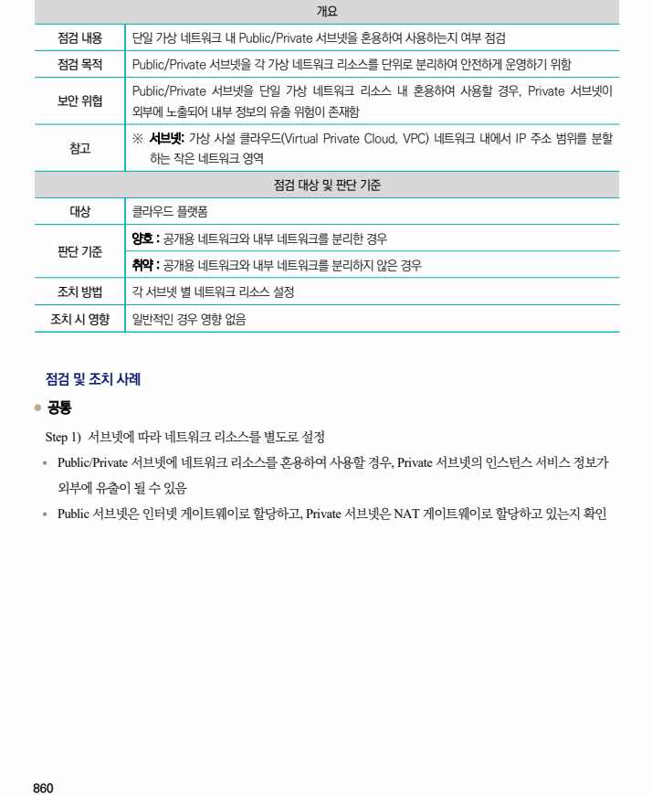

## 원문 전사

### PDF 페이지 860

~~~text transcription
개요
점검 내용 단일 가상 네트워크 내 Public/Private 서브넷을 혼용하여 사용하는지 여부 점검
점검 목적 Public/Private 서브넷을 각 가상 네트워크 리소스를 단위로 분리하여 안전하게 운영하기 위함
Public/Private 서브넷을 단일 가상 네트워크 리소스 내 혼용하여 사용할 경우, Private 서브넷이
보안 위협
외부에 노출되어 내부 정보의 유출 위험이 존재함
※ 서브넷: 가상 사설 클라우드(Virtual Private Cloud, VPC) 네트워크 내에서 IP 주소 범위를 분할
참고
하는 작은 네트워크 영역
점검 대상 및 판단 기준
대상 클라우드 플랫폼
양호 : 공개용 네트워크와 내부 네트워크를 분리한 경우
판단 기준
취약 : 공개용 네트워크와 내부 네트워크를 분리하지 않은 경우
조치 방법 각 서브넷 별 네트워크 리소스 설정
조치 시 영향 일반적인 경우 영향 없음
점검 및 조치 사례
l 공통
Step 1) 서브넷에 따라 네트워크 리소스를 별도로 설정
§ Public/Private 서브넷에 네트워크 리소스를 혼용하여 사용할 경우, Private 서브넷의 인스턴스 서비스 정보가
외부에 유출이 될 수 있음
§ Public 서브넷은 인터넷 게이트웨이로 할당하고, Private 서브넷은 NAT 게이트웨이로 할당하고 있는지 확인
~~~

