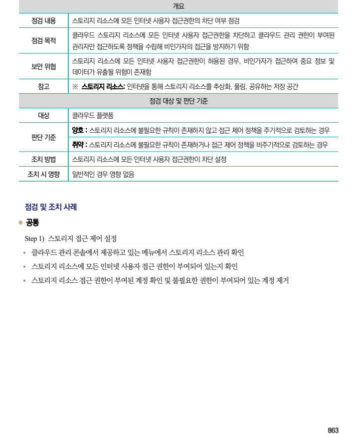

## 원문 전사

### PDF 페이지 863

~~~text transcription
개요
점검 내용 스토리지 리소스에 모든 인터넷 사용자 접근권한의 차단 여부 점검
클라우드 스토리지 리소스에 모든 인터넷 사용자 접근권한을 차단하고 클라우드 관리 권한이 부여된
점검 목적
관리자만 접근하도록 정책을 수립해 비인가자의 접근을 방지하기 위함
스토리지 리소스에 모든 인터넷 사용자 접근권한이 허용된 경우, 비인가자가 접근하여 중요 정보 및
보안 위협
데이터가 유출될 위험이 존재함
참고 ※ 스토리지 리소스: 인터넷을 통해 스토리지 리소스를 추상화, 풀링, 공유하는 저장 공간
점검 대상 및 판단 기준
대상 클라우드 플랫폼
양호 : 스토리지 리소스에 불필요한 규칙이 존재하지 않고 접근 제어 정책을 주기적으로 검토하는 경우
판단 기준
취약 : 스토리지 리소스에 불필요한 규칙이 존재하거나 접근 제어 정책을 비주기적으로 검토하는 경우
조치 방법 스토리지 리소스에 모든 인터넷 사용자 접근권한이 차단 설정
조치 시 영향 일반적인 경우 영향 없음
점검 및 조치 사례
l 공통
Step 1) 스토리지 접근 제어 설정
§ 클라우드 관리 콘솔에서 제공하고 있는 메뉴에서 스토리지 리소스 관리 확인
§ 스토리지 리소스에 모든 인터넷 사용자 접근 권한이 부여되어 있는지 확인
§ 스토리지 리소스 접근 권한이 부여된 계정 확인 및 불필요한 권한이 부여되어 있는 계정 제거
~~~

