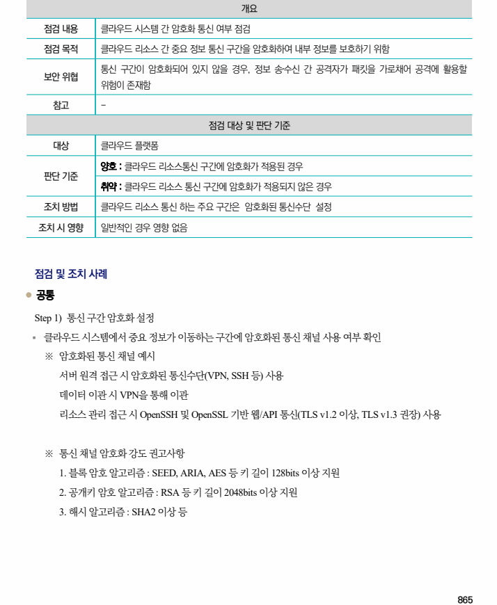

## 원문 전사

### PDF 페이지 865

~~~text transcription
개요
점검 내용 클라우드 시스템 간 암호화 통신 여부 점검
점검 목적 클라우드 리소스 간 중요 정보 통신 구간을 암호화하여 내부 정보를 보호하기 위함
통신 구간이 암호화되어 있지 않을 경우, 정보 송‧수신 간 공격자가 패킷을 가로채어 공격에 활용할
보안 위협
위험이 존재함
참고 -
점검 대상 및 판단 기준
대상 클라우드 플랫폼
양호 : 클라우드 리소스통신 구간에 암호화가 적용된 경우
판단 기준
취약 : 클라우드 리소스 통신 구간에 암호화가 적용되지 않은 경우
조치 방법 클라우드 리소스 통신 하는 주요 구간은 암호화된 통신수단 설정
조치 시 영향 일반적인 경우 영향 없음
점검 및 조치 사례
l 공통
Step 1) 통신 구간 암호화 설정
§ 클라우드 시스템에서 중요 정보가 이동하는 구간에 암호화된 통신 채널 사용 여부 확인
※ 암호화된 통신 채널 예시
서버 원격 접근 시 암호화된 통신수단(VPN, SSH 등) 사용
데이터 이관 시 VPN을 통해 이관
리소스 관리 접근 시 OpenSSH 및 OpenSSL 기반 웹/API 통신(TLS v1.2 이상, TLS v1.3 권장) 사용
※ 통신 채널 암호화 강도 권고사항
1. 블록 암호 알고리즘 : SEED, ARIA, AES 등 키 길이 128bits 이상 지원
2. 공개키 암호 알고리즘 : RSA 등 키 길이 2048bits 이상 지원
3. 해시 알고리즘 : SHA2 이상 등
~~~

