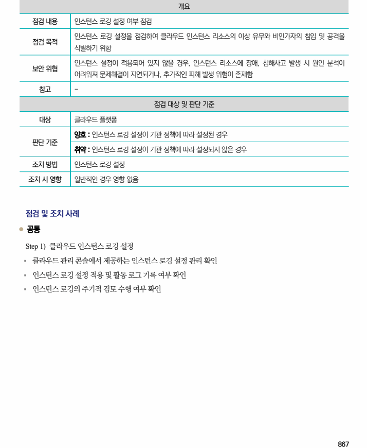

## 원문 전사

### PDF 페이지 867

~~~text transcription
개요
점검 내용 인스턴스 로깅 설정 여부 점검
인스턴스 로깅 설정을 점검하여 클라우드 인스턴스 리소스의 이상 유무와 비인가자의 침입 및 공격을
점검 목적
식별하기 위함
인스턴스 설정이 적용되어 있지 않을 경우, 인스턴스 리소스에 장애, 침해사고 발생 시 원인 분석이
보안 위협
어려워져 문제해결이 지연되거나, 추가적인 피해 발생 위험이 존재함
참고 -
점검 대상 및 판단 기준
대상 클라우드 플랫폼
양호 : 인스턴스 로깅 설정이 기관 정책에 따라 설정된 경우
판단 기준
취약 : 인스턴스 로깅 설정이 기관 정책에 따라 설정되지 않은 경우
조치 방법 인스턴스 로깅 설정
조치 시 영향 일반적인 경우 영향 없음
점검 및 조치 사례
l 공통
Step 1) 클라우드 인스턴스 로깅 설정
§ 클라우드 관리 콘솔에서 제공하는 인스턴스 로깅 설정 관리 확인
§ 인스턴스 로깅 설정 적용 및 활동 로그 기록 여부 확인
§ 인스턴스 로깅의 주기적 검토 수행 여부 확인
~~~

