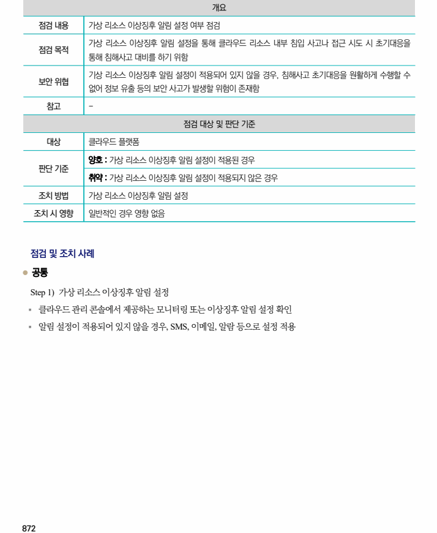

## 원문 전사

### PDF 페이지 872

~~~text transcription
개요
점검 내용 가상 리소스 이상징후 알림 설정 여부 점검
가상 리소스 이상징후 알림 설정을 통해 클라우드 리소스 내부 침입 사고나 접근 시도 시 초기대응을
점검 목적
통해 침해사고 대비를 하기 위함
기상 리소스 이상징후 알림 설정이 적용되어 있지 않을 경우, 침해사고 초기대응을 원활하게 수행할 수
보안 위협
없어 정보 유출 등의 보안 사고가 발생할 위험이 존재함
참고 -
점검 대상 및 판단 기준
대상 클라우드 플랫폼
양호 : 가상 리소스 이상징후 알림 설정이 적용된 경우
판단 기준
취약 : 가상 리소스 이상징후 알림 설정이 적용되지 않은 경우
조치 방법 가상 리소스 이상징후 알림 설정
조치 시 영향 일반적인 경우 영향 없음
점검 및 조치 사례
l 공통
Step 1) 가상 리소스 이상징후 알림 설정
§ 클라우드 관리 콘솔에서 제공하는 모니터링 또는 이상징후 알림 설정 확인
§ 알림 설정이 적용되어 있지 않을 경우, SMS, 이메일, 알람 등으로 설정 적용
~~~

