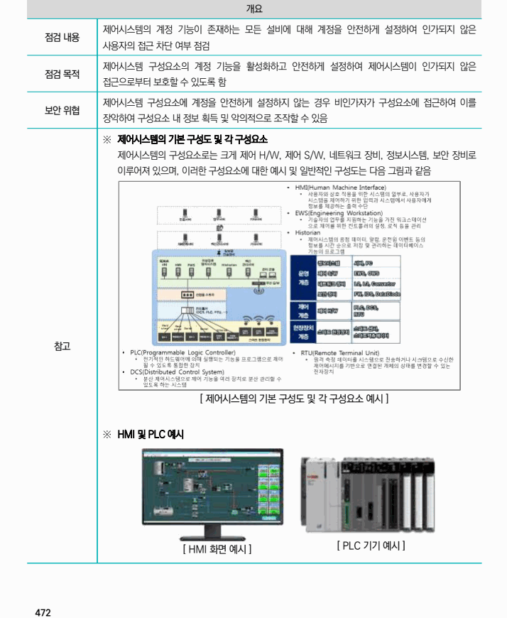
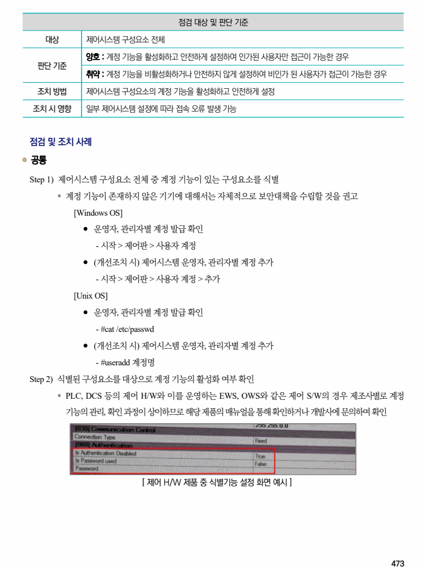
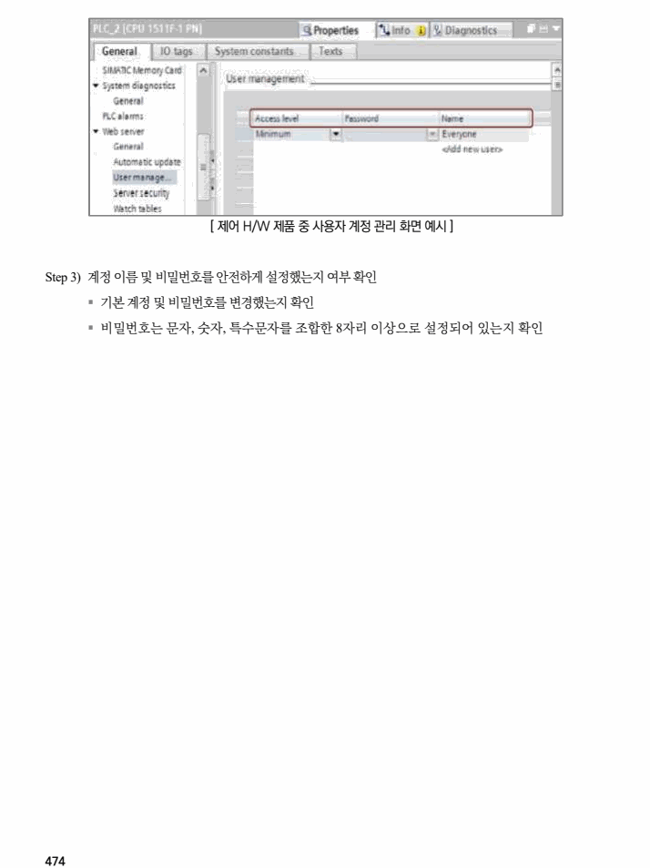

## 원문 전사

### PDF 페이지 472

~~~text transcription
개요
제어시스템의 계정 기능이 존재하는 모든 설비에 대해 계정을 안전하게 설정하여 인가되지 않은
점검 내용
사용자의 접근 차단 여부 점검
제어시스템 구성요소의 계정 기능을 활성화하고 안전하게 설정하여 제어시스템이 인가되지 않은
점검 목적
접근으로부터 보호할 수 있도록 함
제어시스템 구성요소에 계정을 안전하게 설정하지 않는 경우 비인가자가 구성요소에 접근하여 이를
보안 위협
장악하여 구성요소 내 정보 획득 및 악의적으로 조작할 수 있음
※ 제어시스템의 기본 구성도 및 각 구성요소
제어시스템의 구성요소로는 크게 제어 H/W, 제어 S/W, 네트워크 장비, 정보시스템, 보안 장비로
이루어져 있으며, 이러한 구성요소에 대한 예시 및 일반적인 구성도는 다음 그림과 같음
참고
[ 제어시스템의 기본 구성도 및 각 구성요소 예시 ]
※ HMI 및 PLC 예시
[ PLC 기기 예시 ]
[ HMI 화면 예시 ]
~~~

### PDF 페이지 473

~~~text transcription
점검 대상 및 판단 기준
대상 제어시스템 구성요소 전체
양호 : 계정 기능을 활성화하고 안전하게 설정하여 인가된 사용자만 접근이 가능한 경우
판단 기준
취약 : 계정 기능을 비활성화하거나 안전하지 않게 설정하여 비인가 된 사용자가 접근이 가능한 경우
조치 방법 제어시스템 구성요소의 계정 기능을 활성화하고 안전하게 설정
조치 시 영향 일부 제어시스템 설정에 따라 접속 오류 발생 가능
점검 및 조치 사례
l 공통
Step 1) 제어시스템 구성요소 전체 중 계정 기능이 있는 구성요소를 식별
§ 계정 기능이 존재하지 않은 기기에 대해서는 자체적으로 보안대책을 수립할 것을 권고
[Windows OS]
⚫ 운영자, 관리자별 계정 발급 확인
- 시작 > 제어판 > 사용자 계정
⚫ (개선조치 시) 제어시스템 운영자, 관리자별 계정 추가
- 시작 > 제어판 > 사용자 계정 > 추가
[Unix OS]
⚫ 운영자, 관리자별 계정 발급 확인
- #cat /etc/passwd
⚫ (개선조치 시) 제어시스템 운영자, 관리자별 계정 추가
- #useradd 계정명
Step 2) 식별된 구성요소를 대상으로 계정 기능의 활성화 여부 확인
§ PLC, DCS 등의 제어 H/W와 이를 운영하는 EWS, OWS와 같은 제어 S/W의 경우 제조사별로 계정
기능의 관리, 확인 과정이 상이하므로 해당 제품의 매뉴얼을 통해 확인하거나 개발사에 문의하여 확인
[ 제어 H/W 제품 중 식별기능 설정 화면 예시 ]
~~~

### PDF 페이지 474

~~~text transcription
[ 제어 H/W 제품 중 사용자 계정 관리 화면 예시 ]
Step 3) 계정 이름 및 비밀번호를 안전하게 설정했는지 여부 확인
§ 기본 계정 및 비밀번호를 변경했는지 확인
§ 비밀번호는 문자, 숫자, 특수문자를 조합한 8자리 이상으로 설정되어 있는지 확인
~~~

