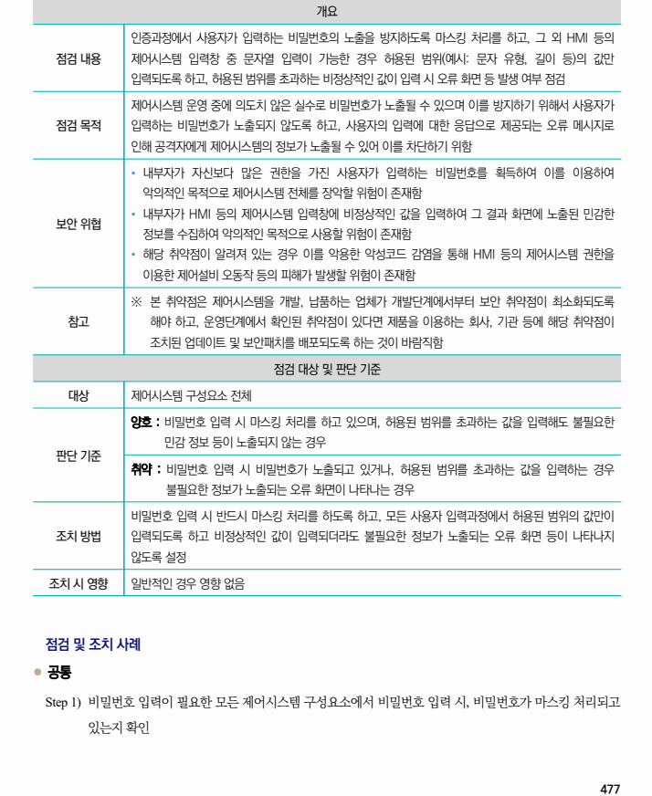
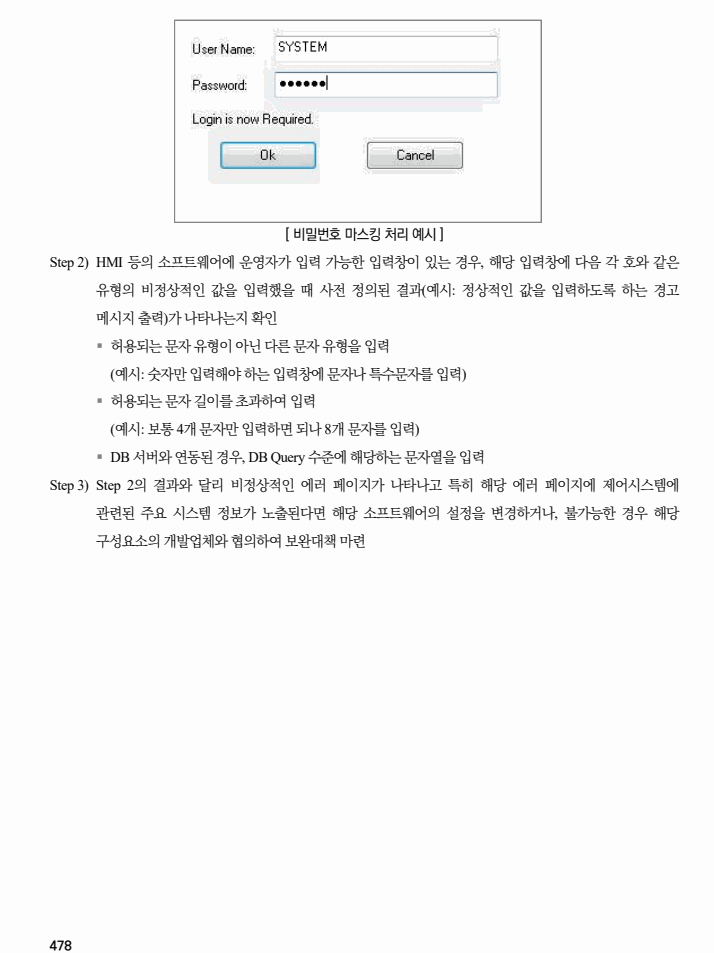

## 원문 전사

### PDF 페이지 477

~~~text transcription
개요
인증과정에서 사용자가 입력하는 비밀번호의 노출을 방지하도록 마스킹 처리를 하고, 그 외 HMI 등의
점검 내용 제어시스템 입력창 중 문자열 입력이 가능한 경우 허용된 범위(예시: 문자 유형, 길이 등)의 값만
입력되도록 하고, 허용된 범위를 초과하는 비정상적인 값이 입력 시 오류 화면 등 발생 여부 점검
제어시스템 운영 중에 의도치 않은 실수로 비밀번호가 노출될 수 있으며 이를 방지하기 위해서 사용자가
점검 목적 입력하는 비밀번호가 노출되지 않도록 하고, 사용자의 입력에 대한 응답으로 제공되는 오류 메시지로
인해 공격자에게 제어시스템의 정보가 노출될 수 있어 이를 차단하기 위함
Ÿ 내부자가 자신보다 많은 권한을 가진 사용자가 입력하는 비밀번호를 획득하여 이를 이용하여
악의적인 목적으로 제어시스템 전체를 장악할 위험이 존재함
Ÿ 내부자가 HMI 등의 제어시스템 입력창에 비정상적인 값을 입력하여 그 결과 화면에 노출된 민감한
보안 위협
정보를 수집하여 악의적인 목적으로 사용할 위험이 존재함
Ÿ 해당 취약점이 알려져 있는 경우 이를 악용한 악성코드 감염을 통해 HMI 등의 제어시스템 권한을
이용한 제어설비 오동작 등의 피해가 발생할 위험이 존재함
※ 본 취약점은 제어시스템을 개발, 납품하는 업체가 개발단계에서부터 보안 취약점이 최소화되도록
참고 해야 하고, 운영단계에서 확인된 취약점이 있다면 제품을 이용하는 회사, 기관 등에 해당 취약점이
조치된 업데이트 및 보안패치를 배포되도록 하는 것이 바람직함
점검 대상 및 판단 기준
대상 제어시스템 구성요소 전체
양호 : 비밀번호 입력 시 마스킹 처리를 하고 있으며, 허용된 범위를 초과하는 값을 입력해도 불필요한
민감 정보 등이 노출되지 않는 경우
판단 기준
취약 : 비밀번호 입력 시 비밀번호가 노출되고 있거나, 허용된 범위를 초과하는 값을 입력하는 경우
불필요한 정보가 노출되는 오류 화면이 나타나는 경우
비밀번호 입력 시 반드시 마스킹 처리를 하도록 하고, 모든 사용자 입력과정에서 허용된 범위의 값만이
조치 방법 입력되도록 하고 비정상적인 값이 입력되더라도 불필요한 정보가 노출되는 오류 화면 등이 나타나지
않도록 설정
조치 시 영향 일반적인 경우 영향 없음
점검 및 조치 사례
l 공통
Step 1) 비밀번호 입력이 필요한 모든 제어시스템 구성요소에서 비밀번호 입력 시, 비밀번호가 마스킹 처리되고
있는지 확인
~~~

### PDF 페이지 478

~~~text transcription
[ 비밀번호 마스킹 처리 예시 ]
Step 2) HMI 등의 소프트웨어에 운영자가 입력 가능한 입력창이 있는 경우, 해당 입력창에 다음 각 호와 같은
유형의 비정상적인 값을 입력했을 때 사전 정의된 결과(예시: 정상적인 값을 입력하도록 하는 경고
메시지 출력)가 나타나는지 확인
§ 허용되는 문자 유형이 아닌 다른 문자 유형을 입력
(예시: 숫자만 입력해야 하는 입력창에 문자나 특수문자를 입력)
§ 허용되는 문자 길이를 초과하여 입력
(예시: 보통 4개 문자만 입력하면 되나 8개 문자를 입력)
§ DB 서버와 연동된 경우, DB Query 수준에 해당하는 문자열을 입력
Step 3) Step 2의 결과와 달리 비정상적인 에러 페이지가 나타나고 특히 해당 에러 페이지에 제어시스템에
관련된 주요 시스템 정보가 노출된다면 해당 소프트웨어의 설정을 변경하거나, 불가능한 경우 해당
구성요소의 개발업체와 협의하여 보완대책 마련
~~~

