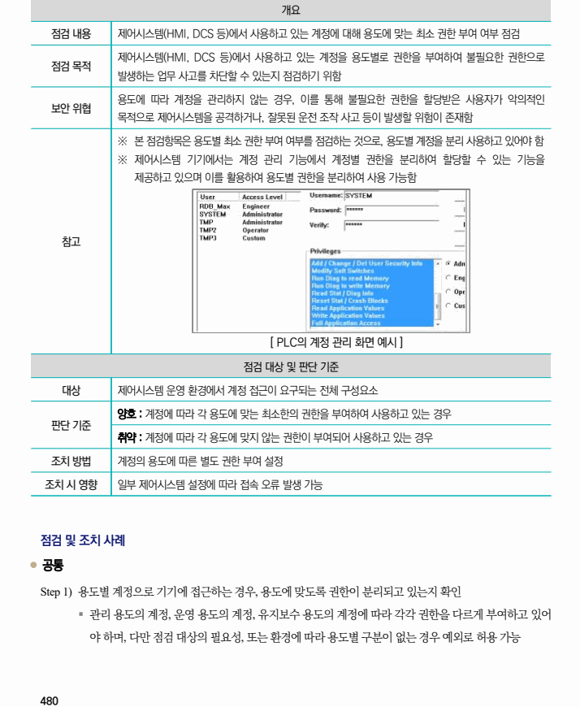
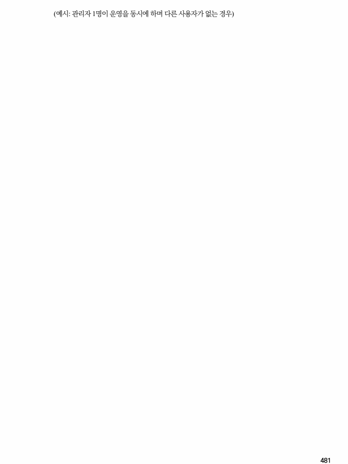

## 원문 전사

### PDF 페이지 480

~~~text transcription
개요
점검 내용 제어시스템(HMI, DCS 등)에서 사용하고 있는 계정에 대해 용도에 맞는 최소 권한 부여 여부 점검
제어시스템(HMI, DCS 등)에서 사용하고 있는 계정을 용도별로 권한을 부여하여 불필요한 권한으로
점검 목적
발생하는 업무 사고를 차단할 수 있는지 점검하기 위함
용도에 따라 계정을 관리하지 않는 경우, 이를 통해 불필요한 권한을 할당받은 사용자가 악의적인
보안 위협
목적으로 제어시스템을 공격하거나, 잘못된 운전 조작 사고 등이 발생할 위험이 존재함
※ 본 점검항목은 용도별 최소 권한 부여 여부를 점검하는 것으로, 용도별 계정을 분리 사용하고 있어야 함
※ 제어시스템 기기에서는 계정 관리 기능에서 계정별 권한을 분리하여 할당할 수 있는 기능을
제공하고 있으며 이를 활용하여 용도별 권한을 분리하여 사용 가능함
참고
[ PLC의 계정 관리 화면 예시 ]
점검 대상 및 판단 기준
대상 제어시스템 운영 환경에서 계정 접근이 요구되는 전체 구성요소
양호 : 계정에 따라 각 용도에 맞는 최소한의 권한을 부여하여 사용하고 있는 경우
판단 기준
취약 : 계정에 따라 각 용도에 맞지 않는 권한이 부여되어 사용하고 있는 경우
조치 방법 계정의 용도에 따른 별도 권한 부여 설정
조치 시 영향 일부 제어시스템 설정에 따라 접속 오류 발생 가능
점검 및 조치 사례
l 공통
Step 1) 용도별 계정으로 기기에 접근하는 경우, 용도에 맞도록 권한이 분리되고 있는지 확인
§ 관리 용도의 계정, 운영 용도의 계정, 유지보수 용도의 계정에 따라 각각 권한을 다르게 부여하고 있어
야 하며, 다만 점검 대상의 필요성, 또는 환경에 따라 용도별 구분이 없는 경우 예외로 허용 가능
~~~

### PDF 페이지 481

~~~text transcription
(예시: 관리자 1명이 운영을 동시에 하며 다른 사용자가 없는 경우)
~~~

