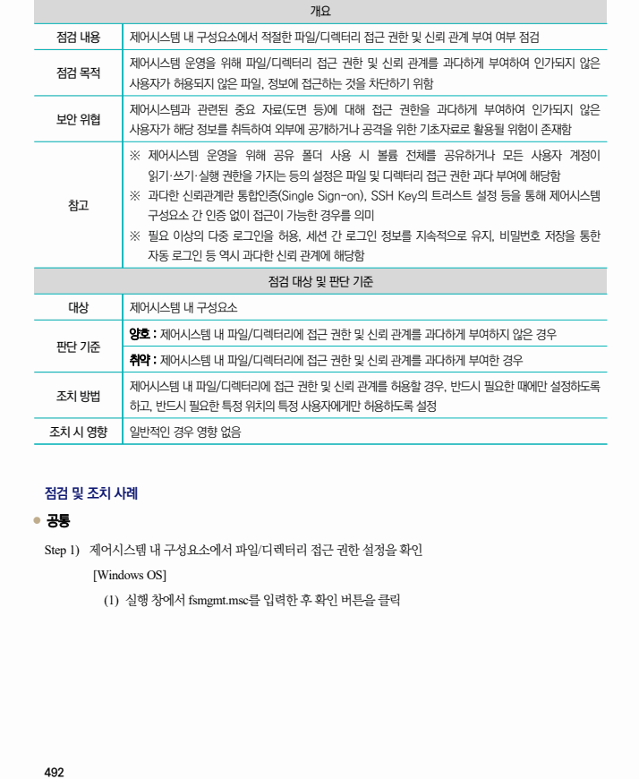
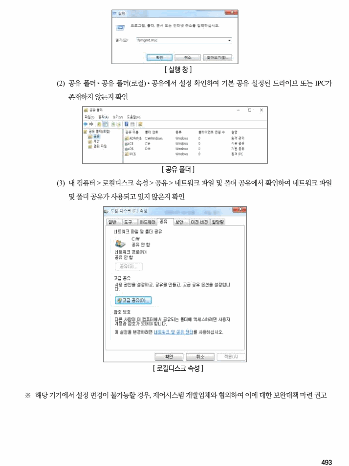

## 원문 전사

### PDF 페이지 492

~~~text transcription
개요
점검 내용 제어시스템 내 구성요소에서 적절한 파일/디렉터리 접근 권한 및 신뢰 관계 부여 여부 점검
제어시스템 운영을 위해 파일/디렉터리 접근 권한 및 신뢰 관계를 과다하게 부여하여 인가되지 않은
점검 목적
사용자가 허용되지 않은 파일, 정보에 접근하는 것을 차단하기 위함
제어시스템과 관련된 중요 자료(도면 등)에 대해 접근 권한을 과다하게 부여하여 인가되지 않은
보안 위협
사용자가 해당 정보를 취득하여 외부에 공개하거나 공격을 위한 기초자료로 활용될 위험이 존재함
※ 제어시스템 운영을 위해 공유 폴더 사용 시 볼륨 전체를 공유하거나 모든 사용자 계정이
읽기·쓰기·실행 권한을 가지는 등의 설정은 파일 및 디렉터리 접근 권한 과다 부여에 해당함
※ 과다한 신뢰관계란 통합인증(Single Sign-on), SSH Key의 트러스트 설정 등을 통해 제어시스템
참고
구성요소 간 인증 없이 접근이 가능한 경우를 의미
※ 필요 이상의 다중 로그인을 허용, 세션 간 로그인 정보를 지속적으로 유지, 비밀번호 저장을 통한
자동 로그인 등 역시 과다한 신뢰 관계에 해당함
점검 대상 및 판단 기준
대상 제어시스템 내 구성요소
양호 : 제어시스템 내 파일/디렉터리에 접근 권한 및 신뢰 관계를 과다하게 부여하지 않은 경우
판단 기준
취약 : 제어시스템 내 파일/디렉터리에 접근 권한 및 신뢰 관계를 과다하게 부여한 경우
제어시스템 내 파일/디렉터리에 접근 권한 및 신뢰 관계를 허용할 경우, 반드시 필요한 때에만 설정하도록
조치 방법
하고, 반드시 필요한 특정 위치의 특정 사용자에게만 허용하도록 설정
조치 시 영향 일반적인 경우 영향 없음
점검 및 조치 사례
l 공통
Step 1) 제어시스템 내 구성요소에서 파일/디렉터리 접근 권한 설정을 확인
[Windows OS]
(1) 실행 창에서 fsmgmt.msc를 입력한 후 확인 버튼을 클릭
~~~

### PDF 페이지 493

~~~text transcription
[ 실행 창 ]
(2) 공유 폴더 ‣ 공유 폴더(로컬) ‣ 공유에서 설정 확인하여 기본 공유 설정된 드라이브 또는 IPC가
존재하지 않는지 확인
[ 공유 폴더 ]
(3) 내 컴퓨터 > 로컬디스크 속성 > 공유 > 네트워크 파일 및 폴더 공유에서 확인하여 네트워크 파일
및 폴더 공유가 사용되고 있지 않은지 확인
[ 로컬디스크 속성 ]
※ 해당 기기에서 설정 변경이 불가능할 경우, 제어시스템 개발업체와 협의하여 이에 대한 보완대책 마련 권고
~~~

