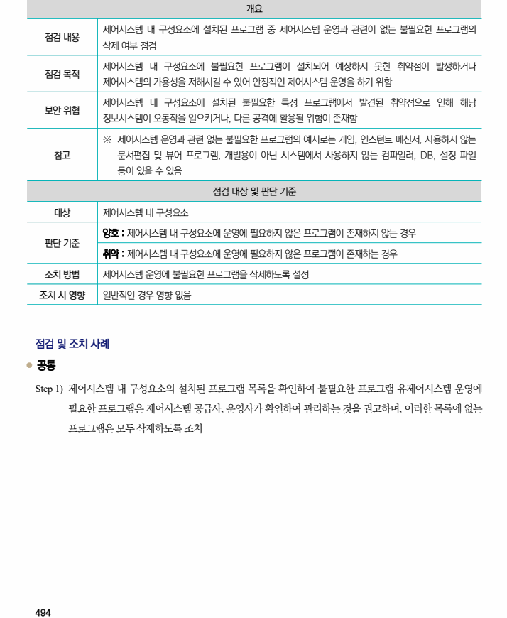

## 원문 전사

### PDF 페이지 494

~~~text transcription
개요
제어시스템 내 구성요소에 설치된 프로그램 중 제어시스템 운영과 관련이 없는 불필요한 프로그램의
점검 내용
삭제 여부 점검
제어시스템 내 구성요소에 불필요한 프로그램이 설치되어 예상하지 못한 취약점이 발생하거나
점검 목적
제어시스템의 가용성을 저해시킬 수 있어 안정적인 제어시스템 운영을 하기 위함
제어시스템 내 구성요소에 설치된 불필요한 특정 프로그램에서 발견된 취약점으로 인해 해당
보안 위협
정보시스템이 오동작을 일으키거나, 다른 공격에 활용될 위험이 존재함
※ 제어시스템 운영과 관련 없는 불필요한 프로그램의 예시로는 게임, 인스턴트 메신저, 사용하지 않는
참고 문서편집 및 뷰어 프로그램, 개발용이 아닌 시스템에서 사용하지 않는 컴파일러, DB, 설정 파일
등이 있을 수 있음
점검 대상 및 판단 기준
대상 제어시스템 내 구성요소
양호 : 제어시스템 내 구성요소에 운영에 필요하지 않은 프로그램이 존재하지 않는 경우
판단 기준
취약 : 제어시스템 내 구성요소에 운영에 필요하지 않은 프로그램이 존재하는 경우
조치 방법 제어시스템 운영에 불필요한 프로그램을 삭제하도록 설정
조치 시 영향 일반적인 경우 영향 없음
점검 및 조치 사례
l 공통
Step 1) 제어시스템 내 구성요소의 설치된 프로그램 목록을 확인하여 불필요한 프로그램 유제어시스템 운영에
필요한 프로그램은 제어시스템 공급사, 운영사가 확인하여 관리하는 것을 권고하며, 이러한 목록에 없는
프로그램은 모두 삭제하도록 조치
~~~

