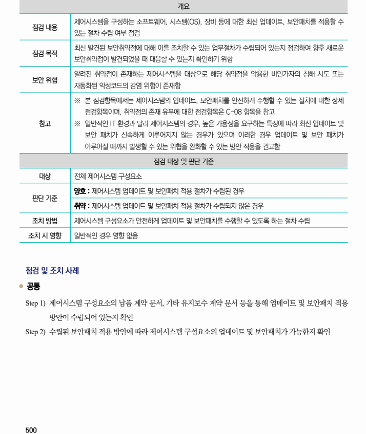

## 원문 전사

### PDF 페이지 500

~~~text transcription
개요
제어시스템을 구성하는 소프트웨어, 시스템(OS), 장비 등에 대한 최신 업데이트, 보안패치를 적용할 수
점검 내용
있는 절차 수립 여부 점검
최신 발견된 보안취약점에 대해 이를 조치할 수 있는 업무절차가 수립되어 있는지 점검하여 향후 새로운
점검 목적
보안취약점이 발견되었을 때 대응할 수 있는지 확인하기 위함
알려진 취약점이 존재하는 제어시스템을 대상으로 해당 취약점을 악용한 비인가자의 침해 시도 또는
보안 위협
자동화된 악성코드의 감염 위험이 존재함
※ 본 점검항목에서는 제어시스템의 업데이트, 보안패치를 안전하게 수행할 수 있는 절차에 대한 상세
점검항목이며, 취약점의 존재 유무에 대한 점검항목은 C-08 항목을 참고
참고 ※ 일반적인 IT 환경과 달리 제어시스템의 경우, 높은 가용성을 요구하는 특징에 따라 최신 업데이트 및
보안 패치가 신속하게 이루어지지 않는 경우가 있으며 이러한 경우 업데이트 및 보안 패치가
이루어질 때까지 발생할 수 있는 위협을 완화할 수 있는 방안 적용을 권고함
점검 대상 및 판단 기준
대상 전체 제어시스템 구성요소
양호 : 제어시스템 업데이트 및 보안패치 적용 절차가 수립된 경우
판단 기준
취약 : 제어시스템 업데이트 및 보안패치 적용 절차가 수립되지 않은 경우
조치 방법 제어시스템 구성요소가 안전하게 업데이트 및 보안패치를 수행할 수 있도록 하는 절차 수립
조치 시 영향 일반적인 경우 영향 없음
점검 및 조치 사례
l 공통
Step 1) 제어시스템 구성요소의 납품 계약 문서, 기타 유지보수 계약 문서 등을 통해 업데이트 및 보안패치 적용
방안이 수립되어 있는지 확인
Step 2) 수립된 보안패치 적용 방안에 따라 제어시스템 구성요소의 업데이트 및 보안패치가 가능한지 확인
~~~

