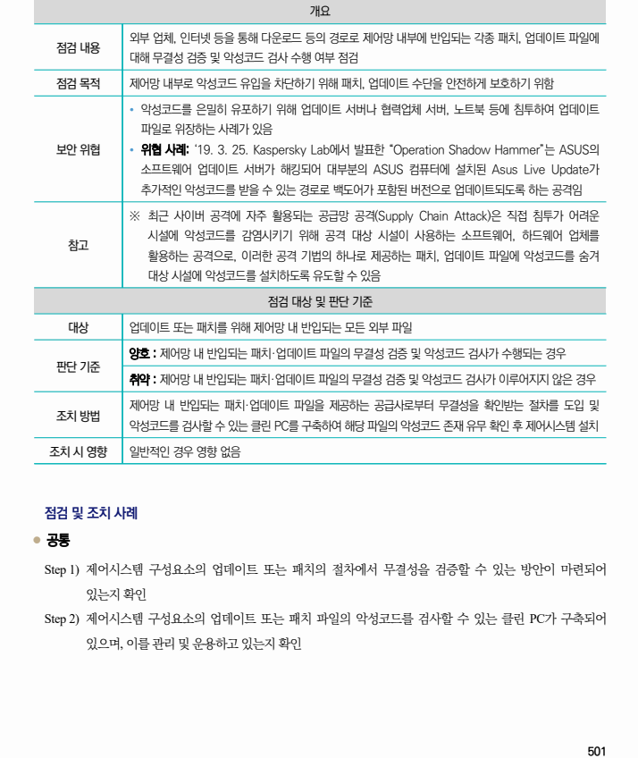

## 원문 전사

### PDF 페이지 501

~~~text transcription
개요
외부 업체, 인터넷 등을 통해 다운로드 등의 경로로 제어망 내부에 반입되는 각종 패치, 업데이트 파일에
점검 내용
대해 무결성 검증 및 악성코드 검사 수행 여부 점검
점검 목적 제어망 내부로 악성코드 유입을 차단하기 위해 패치, 업데이트 수단을 안전하게 보호하기 위함
Ÿ 악성코드를 은밀히 유포하기 위해 업데이트 서버나 협력업체 서버, 노트북 등에 침투하여 업데이트
파일로 위장하는 사례가 있음
보안 위협 Ÿ 위협 사례: ‘19. 3. 25. Kaspersky Lab에서 발표한 “Operation Shadow Hammer”는 ASUS의
소프트웨어 업데이트 서버가 해킹되어 대부분의 ASUS 컴퓨터에 설치된 Asus Live Update가
추가적인 악성코드를 받을 수 있는 경로로 백도어가 포함된 버전으로 업데이트되도록 하는 공격임
※ 최근 사이버 공격에 자주 활용되는 공급망 공격(Supply Chain Attack)은 직접 침투가 어려운
시설에 악성코드를 감염시키기 위해 공격 대상 시설이 사용하는 소프트웨어, 하드웨어 업체를
참고
활용하는 공격으로, 이러한 공격 기법의 하나로 제공하는 패치, 업데이트 파일에 악성코드를 숨겨
대상 시설에 악성코드를 설치하도록 유도할 수 있음
점검 대상 및 판단 기준
대상 업데이트 또는 패치를 위해 제어망 내 반입되는 모든 외부 파일
양호 : 제어망 내 반입되는 패치·업데이트 파일의 무결성 검증 및 악성코드 검사가 수행되는 경우
판단 기준
취약 : 제어망 내 반입되는 패치·업데이트 파일의 무결성 검증 및 악성코드 검사가 이루어지지 않은 경우
제어망 내 반입되는 패치·업데이트 파일을 제공하는 공급사로부터 무결성을 확인받는 절차를 도입 및
조치 방법
악성코드를 검사할 수 있는 클린 PC를 구축하여 해당 파일의 악성코드 존재 유무 확인 후 제어시스템 설치
조치 시 영향 일반적인 경우 영향 없음
점검 및 조치 사례
l 공통
Step 1) 제어시스템 구성요소의 업데이트 또는 패치의 절차에서 무결성을 검증할 수 있는 방안이 마련되어
있는지 확인
Step 2) 제어시스템 구성요소의 업데이트 또는 패치 파일의 악성코드를 검사할 수 있는 클린 PC가 구축되어
있으며, 이를 관리 및 운용하고 있는지 확인
~~~

