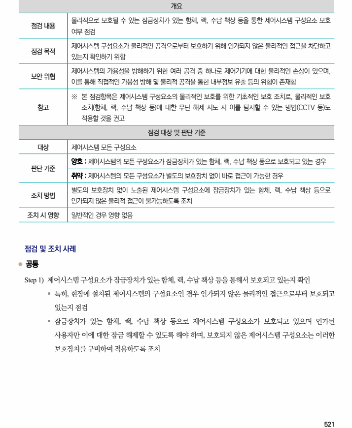

## 원문 전사

### PDF 페이지 521

~~~text transcription
개요
물리적으로 보호될 수 있는 잠금장치가 있는 함체, 랙, 수납 책상 등을 통한 제어시스템 구성요소 보호
점검 내용
여부 점검
제어시스템 구성요소가 물리적인 공격으로부터 보호하기 위해 인가되지 않은 물리적인 접근을 차단하고
점검 목적
있는지 확인하기 위함
제어시스템의 가용성을 방해하기 위한 여러 공격 중 하나로 제어기기에 대한 물리적인 손상이 있으며,
보안 위협
이를 통해 직접적인 가용성 방해 및 물리적 공격을 통한 내부정보 유출 등의 위험이 존재함
※ 본 점검항목은 제어시스템 구성요소의 물리적인 보호를 위한 기초적인 보호 조치로, 물리적인 보호
참고 조치(함체, 랙, 수납 책상 등)에 대한 무단 해제 시도 시 이를 탐지할 수 있는 방법(CCTV 등)도
적용할 것을 권고
점검 대상 및 판단 기준
대상 제어시스템 모든 구성요소
양호 : 제어시스템의 모든 구성요소가 잠금장치가 있는 함체, 랙, 수납 책상 등으로 보호되고 있는 경우
판단 기준
취약 : 제어시스템의 모든 구성요소가 별도의 보호장치 없이 바로 접근이 가능한 경우
별도의 보호장치 없이 노출된 제어시스템 구성요소에 잠금장치가 있는 함체, 랙, 수납 책상 등으로
조치 방법
인가되지 않은 물리적 접근이 불가능하도록 조치
조치 시 영향 일반적인 경우 영향 없음
점검 및 조치 사례
l 공통
Step 1) 제어시스템 구성요소가 잠금장치가 있는 함체, 랙, 수납 책상 등을 통해서 보호되고 있는지 확인
§ 특히, 현장에 설치된 제어시스템의 구성요소인 경우 인가되지 않은 물리적인 접근으로부터 보호되고
있는지 점검
§ 잠금장치가 있는 함체, 랙, 수납 책상 등으로 제어시스템 구성요소가 보호되고 있으며 인가된
사용자만 이에 대한 잠금 해제할 수 있도록 해야 하며, 보호되지 않은 제어시스템 구성요소는 이러한
보호장치를 구비하여 적용하도록 조치
~~~

