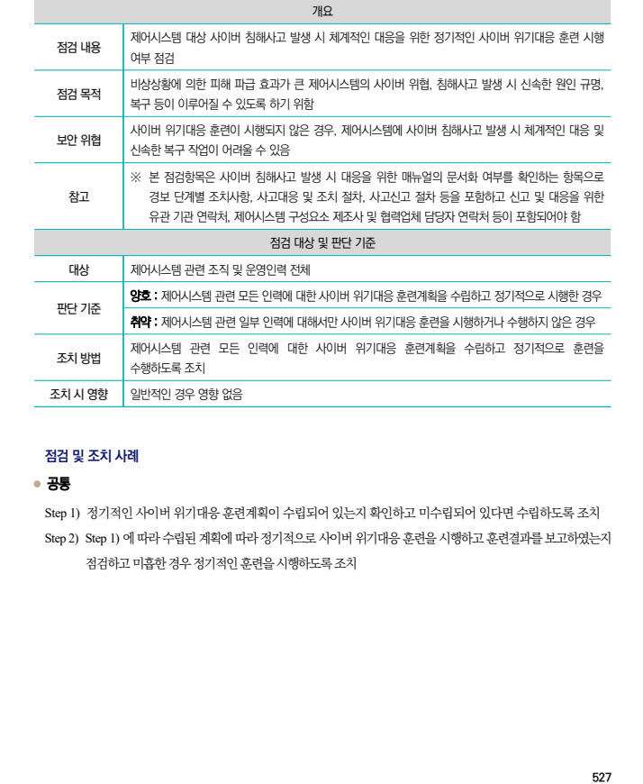

## 원문 전사

### PDF 페이지 527

~~~text transcription
개요
제어시스템 대상 사이버 침해사고 발생 시 체계적인 대응을 위한 정기적인 사이버 위기대응 훈련 시행
점검 내용
여부 점검
비상상황에 의한 피해 파급 효과가 큰 제어시스템의 사이버 위협, 침해사고 발생 시 신속한 원인 규명,
점검 목적
복구 등이 이루어질 수 있도록 하기 위함
사이버 위기대응 훈련이 시행되지 않은 경우, 제어시스템에 사이버 침해사고 발생 시 체계적인 대응 및
보안 위협
신속한 복구 작업이 어려울 수 있음
※ 본 점검항목은 사이버 침해사고 발생 시 대응을 위한 매뉴얼의 문서화 여부를 확인하는 항목으로
참고 경보 단계별 조치사항, 사고대응 및 조치 절차, 사고신고 절차 등을 포함하고 신고 및 대응을 위한
유관 기관 연락처, 제어시스템 구성요소 제조사 및 협력업체 담당자 연락처 등이 포함되어야 함
점검 대상 및 판단 기준
대상 제어시스템 관련 조직 및 운영인력 전체
양호 : 제어시스템 관련 모든 인력에 대한 사이버 위기대응 훈련계획을 수립하고 정기적으로 시행한 경우
판단 기준
취약 : 제어시스템 관련 일부 인력에 대해서만 사이버 위기대응 훈련을 시행하거나 수행하지 않은 경우
제어시스템 관련 모든 인력에 대한 사이버 위기대응 훈련계획을 수립하고 정기적으로 훈련을
조치 방법
수행하도록 조치
조치 시 영향 일반적인 경우 영향 없음
점검 및 조치 사례
l 공통
Step 1) 정기적인 사이버 위기대응 훈련계획이 수립되어 있는지 확인하고 미수립되어 있다면 수립하도록 조치
Step 2) Step 1) 에 따라 수립된 계획에 따라 정기적으로 사이버 위기대응 훈련을 시행하고 훈련결과를 보고하였는지
점검하고 미흡한 경우 정기적인 훈련을 시행하도록 조치
~~~

