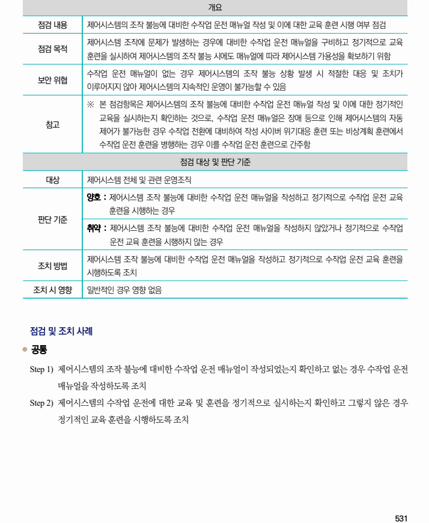

## 원문 전사

### PDF 페이지 531

~~~text transcription
개요
점검 내용 제어시스템의 조작 불능에 대비한 수작업 운전 매뉴얼 작성 및 이에 대한 교육 훈련 시행 여부 점검
제어시스템 조작에 문제가 발생하는 경우에 대비한 수작업 운전 매뉴얼을 구비하고 정기적으로 교육
점검 목적
훈련을 실시하여 제어시스템의 조작 불능 시에도 매뉴얼에 따라 제어시스템 가용성을 확보하기 위함
수작업 운전 매뉴얼이 없는 경우 제어시스템의 조작 불능 상황 발생 시 적절한 대응 및 조치가
보안 위협
이루어지지 않아 제어시스템의 지속적인 운영이 불가능할 수 있음
※ 본 점검항목은 제어시스템의 조작 불능에 대비한 수작업 운전 매뉴얼 작성 및 이에 대한 정기적인
교육을 실시하는지 확인하는 것으로, 수작업 운전 매뉴얼은 장애 등으로 인해 제어시스템의 자동
참고
제어가 불가능한 경우 수작업 전환에 대비하여 작성 사이버 위기대응 훈련 또는 비상계획 훈련에서
수작업 운전 훈련을 병행하는 경우 이를 수작업 운전 훈련으로 간주함
점검 대상 및 판단 기준
대상 제어시스템 전체 및 관련 운영조직
양호 : 제어시스템 조작 불능에 대비한 수작업 운전 매뉴얼을 작성하고 정기적으로 수작업 운전 교육
훈련을 시행하는 경우
판단 기준
취약 : 제어시스템 조작 불능에 대비한 수작업 운전 매뉴얼을 작성하지 않았거나 정기적으로 수작업
운전 교육 훈련을 시행하지 않는 경우
제어시스템 조작 불능에 대비한 수작업 운전 매뉴얼을 작성하고 정기적으로 수작업 운전 교육 훈련을
조치 방법
시행하도록 조치
조치 시 영향 일반적인 경우 영향 없음
점검 및 조치 사례
l 공통
Step 1) 제어시스템의 조작 불능에 대비한 수작업 운전 매뉴얼이 작성되었는지 확인하고 없는 경우 수작업 운전
매뉴얼을 작성하도록 조치
Step 2) 제어시스템의 수작업 운전에 대한 교육 및 훈련을 정기적으로 실시하는지 확인하고 그렇지 않은 경우
정기적인 교육 훈련을 시행하도록 조치
~~~

