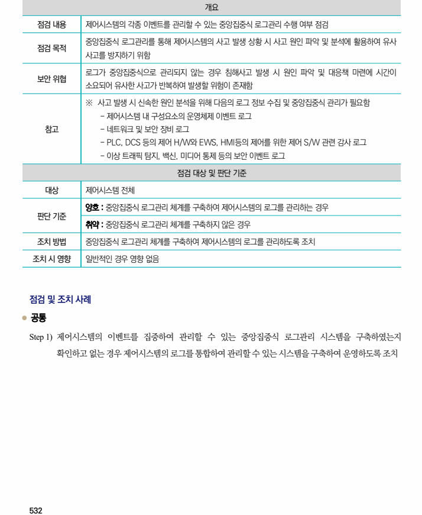

## 원문 전사

### PDF 페이지 532

~~~text transcription
개요
점검 내용 제어시스템의 각종 이벤트를 관리할 수 있는 중앙집중식 로그관리 수행 여부 점검
중앙집중식 로그관리를 통해 제어시스템의 사고 발생 상황 시 사고 원인 파악 및 분석에 활용하여 유사
점검 목적
사고를 방지하기 위함
로그가 중앙집중식으로 관리되지 않는 경우 침해사고 발생 시 원인 파악 및 대응책 마련에 시간이
보안 위협
소요되어 유사한 사고가 반복하여 발생할 위험이 존재함
※ 사고 발생 시 신속한 원인 분석을 위해 다음의 로그 정보 수집 및 중앙집중식 관리가 필요함
- 제어시스템 내 구성요소의 운영체제 이벤트 로그
참고 - 네트워크 및 보안 장비 로그
- PLC, DCS 등의 제어 H/W와 EWS, HMI등의 제어를 위한 제어 S/W 관련 감사 로그
- 이상 트래픽 탐지, 백신, 미디어 통제 등의 보안 이벤트 로그
점검 대상 및 판단 기준
대상 제어시스템 전체
양호 : 중앙집중식 로그관리 체계를 구축하여 제어시스템의 로그를 관리하는 경우
판단 기준
취약 : 중앙집중식 로그관리 체계를 구축하지 않은 경우
조치 방법 중앙집중식 로그관리 체계를 구축하여 제어시스템의 로그를 관리하도록 조치
조치 시 영향 일반적인 경우 영향 없음
점검 및 조치 사례
l 공통
Step 1) 제어시스템의 이벤트를 집중하여 관리할 수 있는 중앙집중식 로그관리 시스템을 구축하였는지
확인하고 없는 경우 제어시스템의 로그를 통합하여 관리할 수 있는 시스템을 구축하여 운영하도록 조치
~~~

