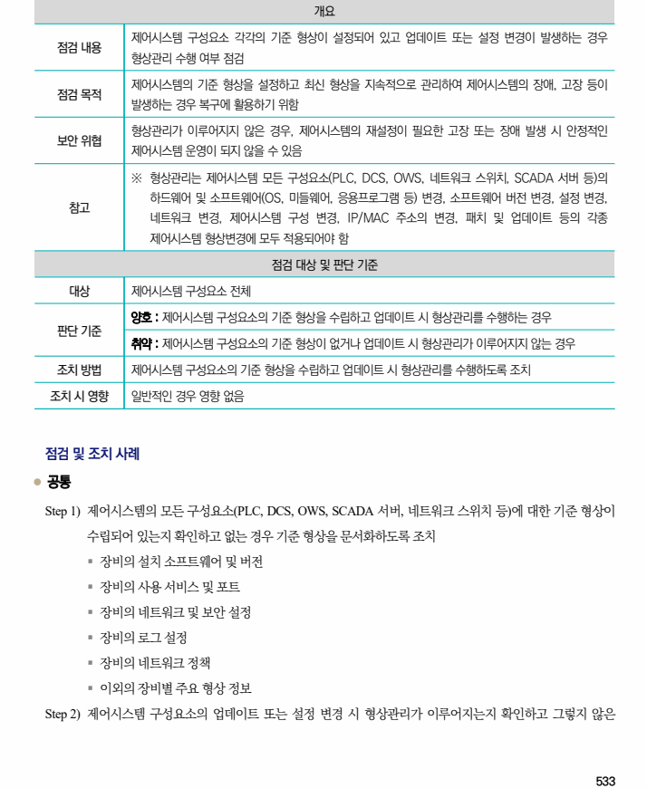

## 원문 전사

### PDF 페이지 533

~~~text transcription
개요
제어시스템 구성요소 각각의 기준 형상이 설정되어 있고 업데이트 또는 설정 변경이 발생하는 경우
점검 내용
형상관리 수행 여부 점검
제어시스템의 기준 형상을 설정하고 최신 형상을 지속적으로 관리하여 제어시스템의 장애, 고장 등이
점검 목적
발생하는 경우 복구에 활용하기 위함
형상관리가 이루어지지 않은 경우, 제어시스템의 재설정이 필요한 고장 또는 장애 발생 시 안정적인
보안 위협
제어시스템 운영이 되지 않을 수 있음
※ 형상관리는 제어시스템 모든 구성요소(PLC, DCS, OWS, 네트워크 스위치, SCADA 서버 등)의
하드웨어 및 소프트웨어(OS, 미들웨어, 응용프로그램 등) 변경, 소프트웨어 버전 변경, 설정 변경,
참고
네트워크 변경, 제어시스템 구성 변경, IP/MAC 주소의 변경, 패치 및 업데이트 등의 각종
제어시스템 형상변경에 모두 적용되어야 함
점검 대상 및 판단 기준
대상 제어시스템 구성요소 전체
양호 : 제어시스템 구성요소의 기준 형상을 수립하고 업데이트 시 형상관리를 수행하는 경우
판단 기준
취약 : 제어시스템 구성요소의 기준 형상이 없거나 업데이트 시 형상관리가 이루어지지 않는 경우
조치 방법 제어시스템 구성요소의 기준 형상을 수립하고 업데이트 시 형상관리를 수행하도록 조치
조치 시 영향 일반적인 경우 영향 없음
점검 및 조치 사례
l 공통
Step 1) 제어시스템의 모든 구성요소(PLC, DCS, OWS, SCADA 서버, 네트워크 스위치 등)에 대한 기준 형상이
수립되어 있는지 확인하고 없는 경우 기준 형상을 문서화하도록 조치
§ 장비의 설치 소프트웨어 및 버전
§ 장비의 사용 서비스 및 포트
§ 장비의 네트워크 및 보안 설정
§ 장비의 로그 설정
§ 장비의 네트워크 정책
§ 이외의 장비별 주요 형상 정보
Step 2) 제어시스템 구성요소의 업데이트 또는 설정 변경 시 형상관리가 이루어지는지 확인하고 그렇지 않은
~~~

### PDF 페이지 534

~~~text transcription
경우 형상관리를 수행하도록 조치
~~~

