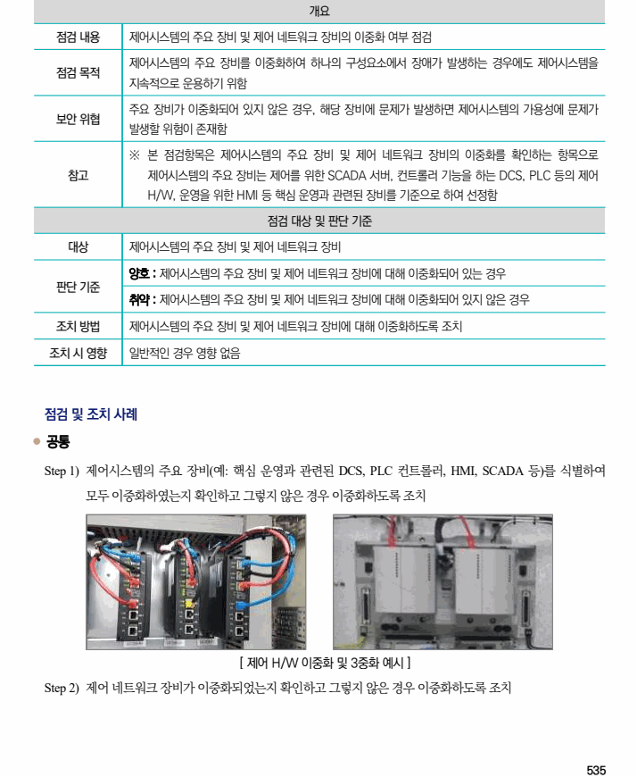

## 원문 전사

### PDF 페이지 535

~~~text transcription
개요
점검 내용 제어시스템의 주요 장비 및 제어 네트워크 장비의 이중화 여부 점검
제어시스템의 주요 장비를 이중화하여 하나의 구성요소에서 장애가 발생하는 경우에도 제어시스템을
점검 목적
지속적으로 운용하기 위함
주요 장비가 이중화되어 있지 않은 경우, 해당 장비에 문제가 발생하면 제어시스템의 가용성에 문제가
보안 위협
발생할 위험이 존재함
※ 본 점검항목은 제어시스템의 주요 장비 및 제어 네트워크 장비의 이중화를 확인하는 항목으로
참고 제어시스템의 주요 장비는 제어를 위한 SCADA 서버, 컨트롤러 기능을 하는 DCS, PLC 등의 제어
H/W, 운영을 위한 HMI 등 핵심 운영과 관련된 장비를 기준으로 하여 선정함
점검 대상 및 판단 기준
대상 제어시스템의 주요 장비 및 제어 네트워크 장비
양호 : 제어시스템의 주요 장비 및 제어 네트워크 장비에 대해 이중화되어 있는 경우
판단 기준
취약 : 제어시스템의 주요 장비 및 제어 네트워크 장비에 대해 이중화되어 있지 않은 경우
조치 방법 제어시스템의 주요 장비 및 제어 네트워크 장비에 대해 이중화하도록 조치
조치 시 영향 일반적인 경우 영향 없음
점검 및 조치 사례
l 공통
Step 1) 제어시스템의 주요 장비(예: 핵심 운영과 관련된 DCS, PLC 컨트롤러, HMI, SCADA 등)를 식별하여
모두 이중화하였는지 확인하고 그렇지 않은 경우 이중화하도록 조치
[ 제어 H/W 이중화 및 3중화 예시 ]
Step 2) 제어 네트워크 장비가 이중화되었는지 확인하고 그렇지 않은 경우 이중화하도록 조치
~~~

