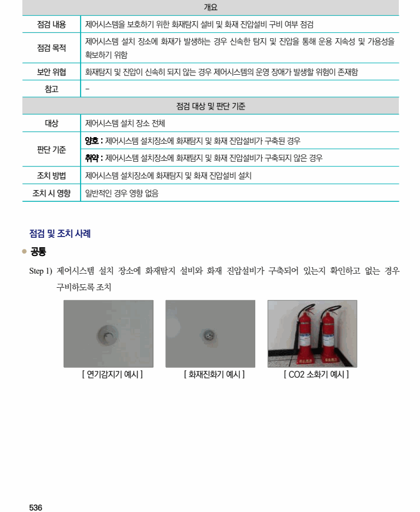

## 원문 전사

### PDF 페이지 536

~~~text transcription
개요
점검 내용 제어시스템을 보호하기 위한 화재탐지 설비 및 화재 진압설비 구비 여부 점검
제어시스템 설치 장소에 화재가 발생하는 경우 신속한 탐지 및 진압을 통해 운용 지속성 및 가용성을
점검 목적
확보하기 위함
보안 위협 화재탐지 및 진압이 신속히 되지 않는 경우 제어시스템의 운영 장애가 발생할 위험이 존재함
참고 -
점검 대상 및 판단 기준
대상 제어시스템 설치 장소 전체
양호 : 제어시스템 설치장소에 화재탐지 및 화재 진압설비가 구축된 경우
판단 기준
취약 : 제어시스템 설치장소에 화재탐지 및 화재 진압설비가 구축되지 않은 경우
조치 방법 제어시스템 설치장소에 화재탐지 및 화재 진압설비 설치
조치 시 영향 일반적인 경우 영향 없음
점검 및 조치 사례
l 공통
Step 1) 제어시스템 설치 장소에 화재탐지 설비와 화재 진압설비가 구축되어 있는지 확인하고 없는 경우
구비하도록 조치
[ 연기감지기 예시 ] [ 화재진화기 예시 ] [ CO2 소화기 예시 ]
~~~

