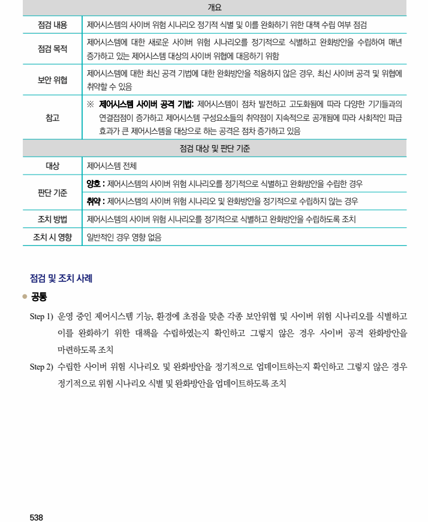

## 원문 전사

### PDF 페이지 538

~~~text transcription
개요
점검 내용 제어시스템의 사이버 위험 시나리오 정기적 식별 및 이를 완화하기 위한 대책 수립 여부 점검
제어시스템에 대한 새로운 사이버 위험 시나리오를 정기적으로 식별하고 완화방안을 수립하여 매년
점검 목적
증가하고 있는 제어시스템 대상의 사이버 위협에 대응하기 위함
제어시스템에 대한 최신 공격 기법에 대한 완화방안을 적용하지 않은 경우, 최신 사이버 공격 및 위협에
보안 위협
취약할 수 있음
※ 제어시스템 사이버 공격 기법: 제어시스템이 점차 발전하고 고도화됨에 따라 다양한 기기들과의
참고 연결접점이 증가하고 제어시스템 구성요소들의 취약점이 지속적으로 공개됨에 따라 사회적인 파급
효과가 큰 제어시스템을 대상으로 하는 공격은 점차 증가하고 있음
점검 대상 및 판단 기준
대상 제어시스템 전체
양호 : 제어시스템의 사이버 위험 시나리오를 정기적으로 식별하고 완화방안을 수립한 경우
판단 기준
취약 : 제어시스템의 사이버 위험 시나리오 및 완화방안을 정기적으로 수립하지 않는 경우
조치 방법 제어시스템의 사이버 위험 시나리오를 정기적으로 식별하고 완화방안을 수립하도록 조치
조치 시 영향 일반적인 경우 영향 없음
점검 및 조치 사례
l 공통
Step 1) 운영 중인 제어시스템 기능, 환경에 초점을 맞춘 각종 보안위협 및 사이버 위험 시나리오를 식별하고
이를 완화하기 위한 대책을 수립하였는지 확인하고 그렇지 않은 경우 사이버 공격 완화방안을
마련하도록 조치
Step 2) 수립한 사이버 위험 시나리오 및 완화방안을 정기적으로 업데이트하는지 확인하고 그렇지 않은 경우
정기적으로 위험 시나리오 식별 및 완화방안을 업데이트하도록 조치
~~~

