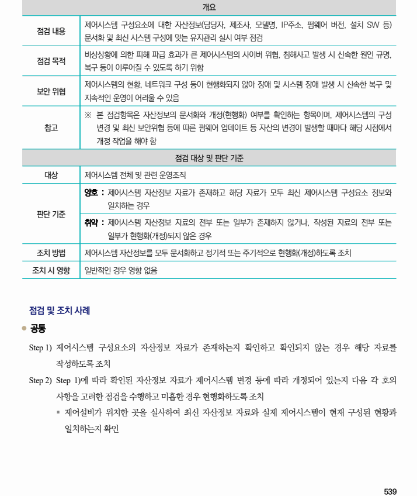
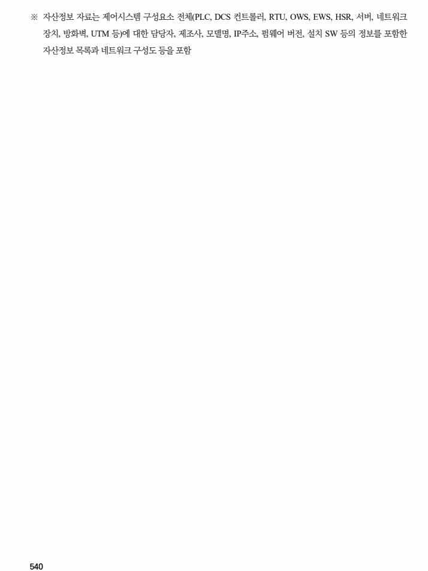

## 원문 전사

### PDF 페이지 539

~~~text transcription
개요
제어시스템 구성요소에 대한 자산정보(담당자, 제조사, 모델명, IP주소, 펌웨어 버전, 설치 SW 등)
점검 내용
문서화 및 최신 시스템 구성에 맞는 유지관리 실시 여부 점검
비상상황에 의한 피해 파급 효과가 큰 제어시스템의 사이버 위협, 침해사고 발생 시 신속한 원인 규명,
점검 목적
복구 등이 이루어질 수 있도록 하기 위함
제어시스템의 현황, 네트워크 구성 등이 현행화되지 않아 장애 및 시스템 장애 발생 시 신속한 복구 및
보안 위협
지속적인 운영이 어려울 수 있음
※ 본 점검항목은 자산정보의 문서화와 개정(현행화) 여부를 확인하는 항목이며, 제어시스템의 구성
참고 변경 및 최신 보안위협 등에 따른 펌웨어 업데이트 등 자산의 변경이 발생할 때마다 해당 시점에서
개정 작업을 해야 함
점검 대상 및 판단 기준
대상 제어시스템 전체 및 관련 운영조직
양호 : 제어시스템 자산정보 자료가 존재하고 해당 자료가 모두 최신 제어시스템 구성요소 정보와
일치하는 경우
판단 기준
취약 : 제어시스템 자산정보 자료의 전부 또는 일부가 존재하지 않거나, 작성된 자료의 전부 또는
일부가 현행화(개정)되지 않은 경우
조치 방법 제어시스템 자산정보를 모두 문서화하고 정기적 또는 주기적으로 현행화(개정)하도록 조치
조치 시 영향 일반적인 경우 영향 없음
점검 및 조치 사례
l 공통
Step 1) 제어시스템 구성요소의 자산정보 자료가 존재하는지 확인하고 확인되지 않는 경우 해당 자료를
작성하도록 조치
Step 2) Step 1)에 따라 확인된 자산정보 자료가 제어시스템 변경 등에 따라 개정되어 있는지 다음 각 호의
사항을 고려한 점검을 수행하고 미흡한 경우 현행화하도록 조치
§ 제어설비가 위치한 곳을 실사하여 최신 자산정보 자료와 실제 제어시스템이 현재 구성된 현황과
일치하는지 확인
~~~

### PDF 페이지 540

~~~text transcription
※ 자산정보 자료는 제어시스템 구성요소 전체(PLC, DCS 컨트롤러, RTU, OWS, EWS, HSR, 서버, 네트워크
장치, 방화벽, UTM 등)에 대한 담당자, 제조사, 모델명, IP주소, 펌웨어 버전, 설치 SW 등의 정보를 포함한
자산정보 목록과 네트워크 구성도 등을 포함
~~~

