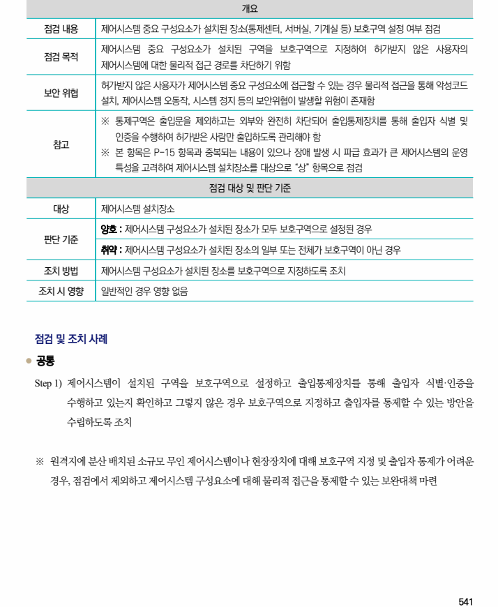

## 원문 전사

### PDF 페이지 541

~~~text transcription
개요
점검 내용 제어시스템 중요 구성요소가 설치된 장소(통제센터, 서버실, 기계실 등) 보호구역 설정 여부 점검
제어시스템 중요 구성요소가 설치된 구역을 보호구역으로 지정하여 허가받지 않은 사용자의
점검 목적
제어시스템에 대한 물리적 접근 경로를 차단하기 위함
허가받지 않은 사용자가 제어시스템 중요 구성요소에 접근할 수 있는 경우 물리적 접근을 통해 악성코드
보안 위협
설치, 제어시스템 오동작, 시스템 정지 등의 보안위협이 발생할 위험이 존재함
※ 통제구역은 출입문을 제외하고는 외부와 완전히 차단되어 출입통제장치를 통해 출입자 식별 및
인증을 수행하여 허가받은 사람만 출입하도록 관리해야 함
참고
※ 본 항목은 P-15 항목과 중복되는 내용이 있으나 장애 발생 시 파급 효과가 큰 제어시스템의 운영
특성을 고려하여 제어시스템 설치장소를 대상으로 “상” 항목으로 점검
점검 대상 및 판단 기준
대상 제어시스템 설치장소
양호 : 제어시스템 구성요소가 설치된 장소가 모두 보호구역으로 설정된 경우
판단 기준
취약 : 제어시스템 구성요소가 설치된 장소의 일부 또는 전체가 보호구역이 아닌 경우
조치 방법 제어시스템 구성요소가 설치된 장소를 보호구역으로 지정하도록 조치
조치 시 영향 일반적인 경우 영향 없음
점검 및 조치 사례
l 공통
Step 1) 제어시스템이 설치된 구역을 보호구역으로 설정하고 출입통제장치를 통해 출입자 식별·인증을
수행하고 있는지 확인하고 그렇지 않은 경우 보호구역으로 지정하고 출입자를 통제할 수 있는 방안을
수립하도록 조치
※ 원격지에 분산 배치된 소규모 무인 제어시스템이나 현장장치에 대해 보호구역 지정 및 출입자 통제가 어려운
경우, 점검에서 제외하고 제어시스템 구성요소에 대해 물리적 접근을 통제할 수 있는 보완대책 마련
~~~

