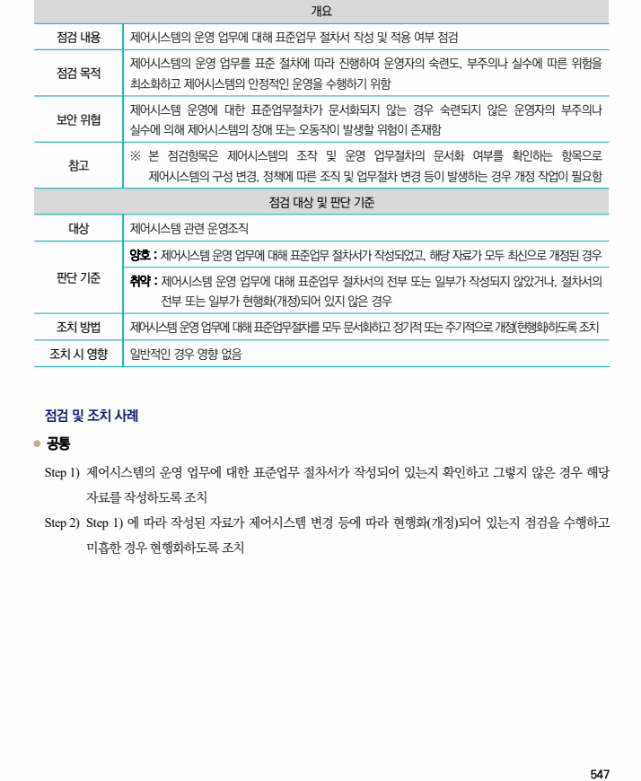

## 원문 전사

### PDF 페이지 547

~~~text transcription
개요
점검 내용 제어시스템의 운영 업무에 대해 표준업무 절차서 작성 및 적용 여부 점검
제어시스템의 운영 업무를 표준 절차에 따라 진행하여 운영자의 숙련도, 부주의나 실수에 따른 위험을
점검 목적
최소화하고 제어시스템의 안정적인 운영을 수행하기 위함
제어시스템 운영에 대한 표준업무절차가 문서화되지 않는 경우 숙련되지 않은 운영자의 부주의나
보안 위협
실수에 의해 제어시스템의 장애 또는 오동작이 발생할 위험이 존재함
※ 본 점검항목은 제어시스템의 조작 및 운영 업무절차의 문서화 여부를 확인하는 항목으로
참고
제어시스템의 구성 변경, 정책에 따른 조직 및 업무절차 변경 등이 발생하는 경우 개정 작업이 필요함
점검 대상 및 판단 기준
대상 제어시스템 관련 운영조직
양호 : 제어시스템 운영 업무에 대해 표준업무 절차서가 작성되었고, 해당 자료가 모두 최신으로 개정된 경우
판단 기준 취약 : 제어시스템 운영 업무에 대해 표준업무 절차서의 전부 또는 일부가 작성되지 않았거나, 절차서의
전부 또는 일부가 현행화(개정)되어 있지 않은 경우
조치 방법 제어시스템 운영 업무에 대해 표준업무절차를 모두 문서화하고 정기적 또는 주기적으로 개정(현행화)하도록 조치
조치 시 영향 일반적인 경우 영향 없음
점검 및 조치 사례
l 공통
Step 1) 제어시스템의 운영 업무에 대한 표준업무 절차서가 작성되어 있는지 확인하고 그렇지 않은 경우 해당
자료를 작성하도록 조치
Step 2) Step 1) 에 따라 작성된 자료가 제어시스템 변경 등에 따라 현행화(개정)되어 있는지 점검을 수행하고
미흡한 경우 현행화하도록 조치
~~~

