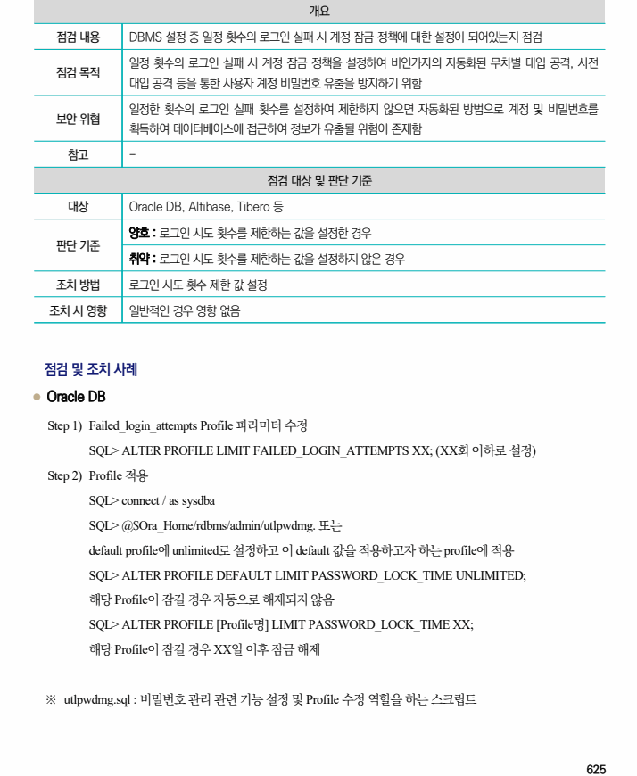
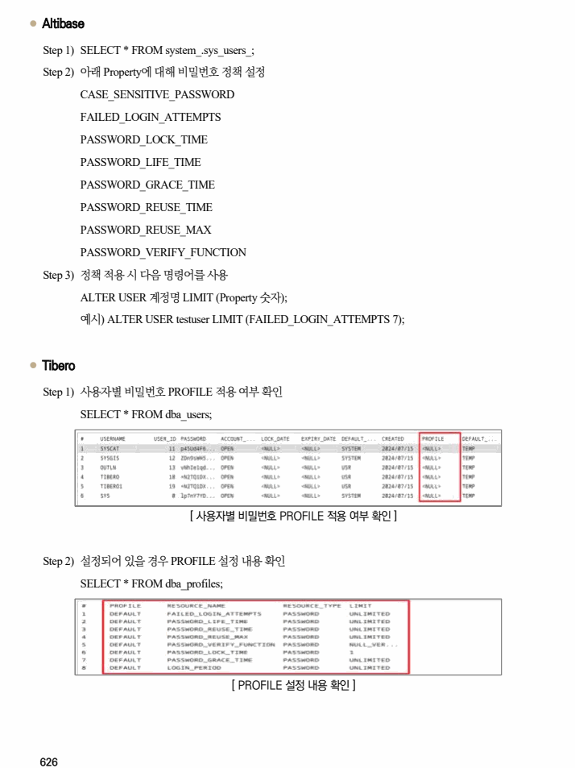
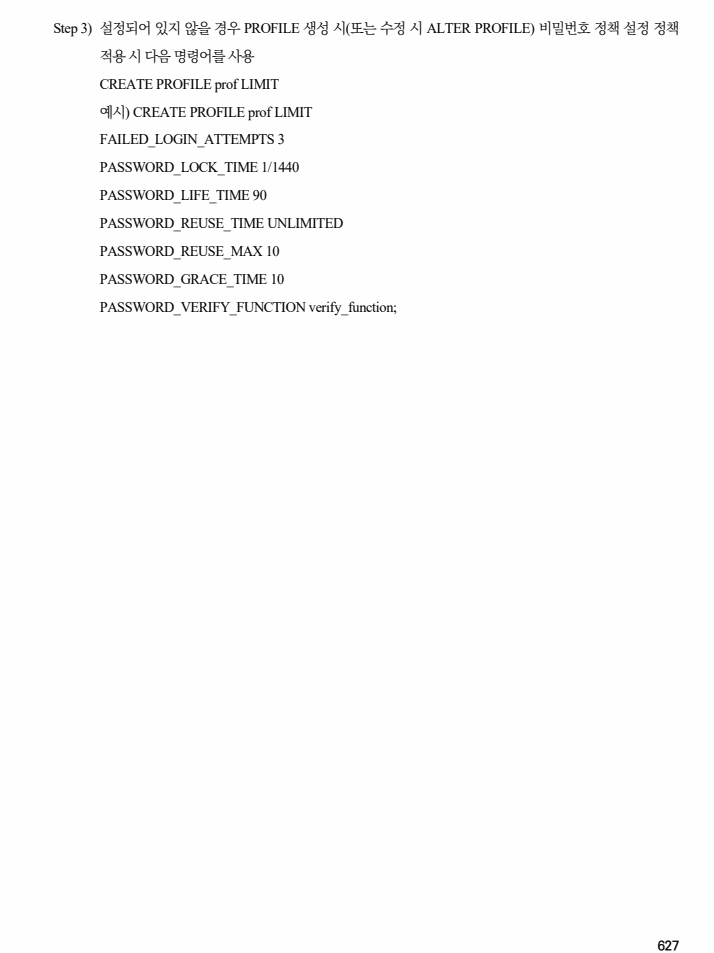

## 원문 전사

### PDF 페이지 625

~~~text transcription
개요
점검 내용 DBMS 설정 중 일정 횟수의 로그인 실패 시 계정 잠금 정책에 대한 설정이 되어있는지 점검
일정 횟수의 로그인 실패 시 계정 잠금 정책을 설정하여 비인가자의 자동화된 무차별 대입 공격, 사전
점검 목적
대입 공격 등을 통한 사용자 계정 비밀번호 유출을 방지하기 위함
일정한 횟수의 로그인 실패 횟수를 설정하여 제한하지 않으면 자동화된 방법으로 계정 및 비밀번호를
보안 위협
획득하여 데이터베이스에 접근하여 정보가 유출될 위험이 존재함
참고 -
점검 대상 및 판단 기준
대상 Oracle DB, Altibase, Tibero 등
양호 : 로그인 시도 횟수를 제한하는 값을 설정한 경우
판단 기준
취약 : 로그인 시도 횟수를 제한하는 값을 설정하지 않은 경우
조치 방법 로그인 시도 횟수 제한 값 설정
조치 시 영향 일반적인 경우 영향 없음
점검 및 조치 사례
l Oracle DB
Step 1) Failed_login_attempts Profile 파라미터 수정
SQL> ALTER PROFILE LIMIT FAILED_LOGIN_ATTEMPTS XX; (XX회 이하로 설정)
Step 2) Profile 적용
SQL> connect / as sysdba
SQL> @$Ora_Home/rdbms/admin/utlpwdmg. 또는
default profile에 unlimited로 설정하고 이 default 값을 적용하고자 하는 profile에 적용
SQL> ALTER PROFILE DEFAULT LIMIT PASSWORD_LOCK_TIME UNLIMITED;
해당 Profile이 잠길 경우 자동으로 해제되지 않음
SQL> ALTER PROFILE [Profile명] LIMIT PASSWORD_LOCK_TIME XX;
해당 Profile이 잠길 경우 XX일 이후 잠금 해제
※ utlpwdmg.sql : 비밀번호 관리 관련 기능 설정 및 Profile 수정 역할을 하는 스크립트
~~~

### PDF 페이지 626

~~~text transcription
l Altibase
Step 1) SELECT * FROM system_.sys_users_;
Step 2) 아래 Property에 대해 비밀번호 정책 설정
CASE_SENSITIVE_PASSWORD
FAILED_LOGIN_ATTEMPTS
PASSWORD_LOCK_TIME
PASSWORD_LIFE_TIME
PASSWORD_GRACE_TIME
PASSWORD_REUSE_TIME
PASSWORD_REUSE_MAX
PASSWORD_VERIFY_FUNCTION
Step 3) 정책 적용 시 다음 명령어를 사용
ALTER USER 계정명 LIMIT (Property 숫자);
예시) ALTER USER testuser LIMIT (FAILED_LOGIN_ATTEMPTS 7);
l Tibero
Step 1) 사용자별 비밀번호 PROFILE 적용 여부 확인
SELECT * FROM dba_users;
[ 사용자별 비밀번호 PROFILE 적용 여부 확인 ]
Step 2) 설정되어 있을 경우 PROFILE 설정 내용 확인
SELECT * FROM dba_profiles;
[ PROFILE 설정 내용 확인 ]
~~~

### PDF 페이지 627

~~~text transcription
Step 3) 설정되어 있지 않을 경우 PROFILE 생성 시(또는 수정 시 ALTER PROFILE) 비밀번호 정책 설정 정책
적용 시 다음 명령어를 사용
CREATE PROFILE prof LIMIT
예시) CREATE PROFILE prof LIMIT
FAILED_LOGIN_ATTEMPTS 3
PASSWORD_LOCK_TIME 1/1440
PASSWORD_LIFE_TIME 90
PASSWORD_REUSE_TIME UNLIMITED
PASSWORD_REUSE_MAX 10
PASSWORD_GRACE_TIME 10
PASSWORD_VERIFY_FUNCTION verify_function;
~~~

