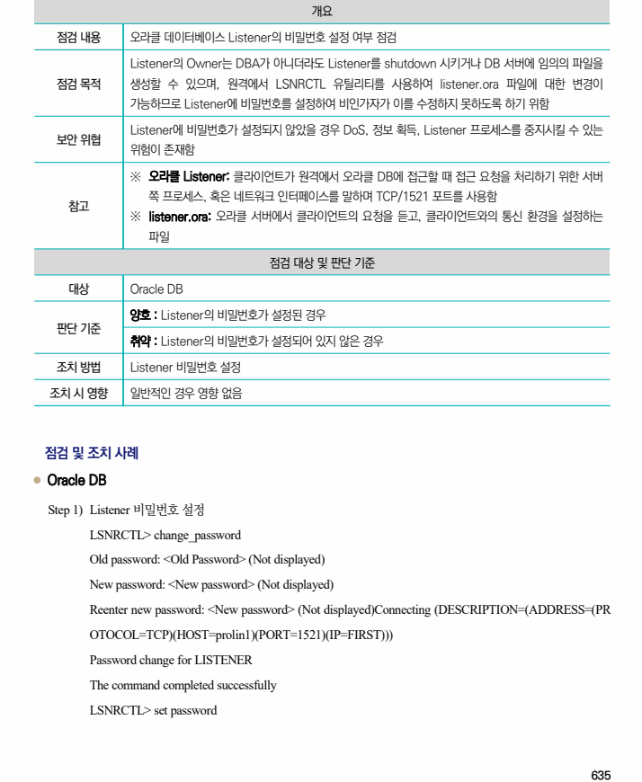
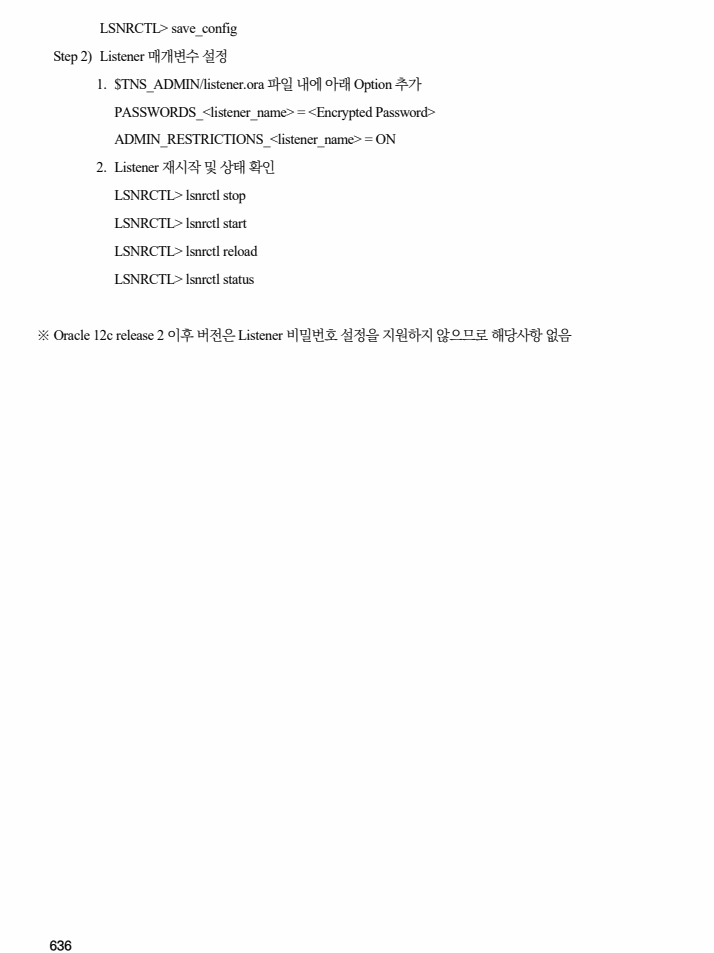

## 원문 전사

### PDF 페이지 635

~~~text transcription
개요
점검 내용 오라클 데이터베이스 Listener의 비밀번호 설정 여부 점검
Listener의 Owner는 DBA가 아니더라도 Listener를 shutdown 시키거나 DB 서버에 임의의 파일을
점검 목적 생성할 수 있으며, 원격에서 LSNRCTL 유틸리티를 사용하여 listener.ora 파일에 대한 변경이
가능하므로 Listener에 비밀번호를 설정하여 비인가자가 이를 수정하지 못하도록 하기 위함
Listener에 비밀번호가 설정되지 않았을 경우 DoS, 정보 획득, Listener 프로세스를 중지시킬 수 있는
보안 위협
위험이 존재함
※ 오라클 Listener: 클라이언트가 원격에서 오라클 DB에 접근할 때 접근 요청을 처리하기 위한 서버
쪽 프로세스, 혹은 네트워크 인터페이스를 말하며 TCP/1521 포트를 사용함
참고
※ listener.ora: 오라클 서버에서 클라이언트의 요청을 듣고, 클라이언트와의 통신 환경을 설정하는
파일
점검 대상 및 판단 기준
대상 Oracle DB
양호 : Listener의 비밀번호가 설정된 경우
판단 기준
취약 : Listener의 비밀번호가 설정되어 있지 않은 경우
조치 방법 Listener 비밀번호 설정
조치 시 영향 일반적인 경우 영향 없음
점검 및 조치 사례
l Oracle DB
Step 1) Listener 비밀번호 설정
LSNRCTL> change_password
Old password: <Old Password> (Not displayed)
New password: <New password> (Not displayed)
Reenter new password: <New password> (Not displayed)Connecting (DESCRIPTION=(ADDRESS=(PR
OTOCOL=TCP)(HOST=prolin1)(PORT=1521)(IP=FIRST)))
Password change for LISTENER
The command completed successfully
LSNRCTL> set password
~~~

### PDF 페이지 636

~~~text transcription
LSNRCTL> save_config
Step 2) Listener 매개변수 설정
1. $TNS_ADMIN/listener.ora 파일 내에 아래 Option 추가
PASSWORDS_<listener_name> = <Encrypted Password>
ADMIN_RESTRICTIONS_<listener_name> = ON
2. Listener 재시작 및 상태 확인
LSNRCTL> lsnrctl stop
LSNRCTL> lsnrctl start
LSNRCTL> lsnrctl reload
LSNRCTL> lsnrctl status
※ Oracle 12c release 2 이후 버전은 Listener 비밀번호 설정을 지원하지 않으므로 해당사항 없음
~~~

