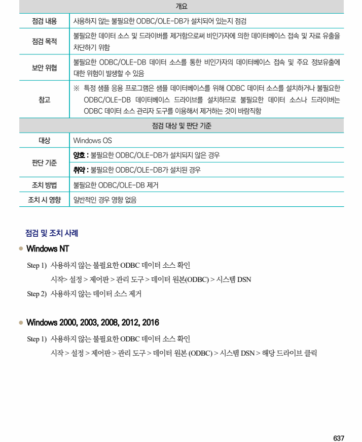
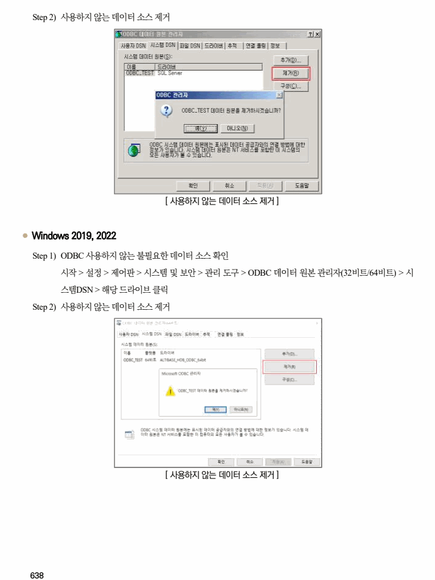

## 원문 전사

### PDF 페이지 637

~~~text transcription
개요
점검 내용 사용하지 않는 불필요한 ODBC/OLE-DB가 설치되어 있는지 점검
불필요한 데이터 소스 및 드라이버를 제거함으로써 비인가자에 의한 데이터베이스 접속 및 자료 유출을
점검 목적
차단하기 위함
불필요한 ODBC/OLE-DB 데이터 소스를 통한 비인가자의 데이터베이스 접속 및 주요 정보유출에
보안 위협
대한 위험이 발생할 수 있음
※ 특정 샘플 응용 프로그램은 샘플 데이터베이스를 위해 ODBC 데이터 소스를 설치하거나 불필요한
참고 ODBC/OLE-DB 데이터베이스 드라이브를 설치하므로 불필요한 데이터 소스나 드라이버는
ODBC 데이터 소스 관리자 도구를 이용해서 제거하는 것이 바람직함
점검 대상 및 판단 기준
대상 Windows OS
양호 : 불필요한 ODBC/OLE-DB가 설치되지 않은 경우
판단 기준
취약 : 불필요한 ODBC/OLE-DB가 설치된 경우
조치 방법 불필요한 ODBC/OLE-DB 제거
조치 시 영향 일반적인 경우 영향 없음
점검 및 조치 사례
l Windows NT
Step 1) 사용하지 않는 불필요한 ODBC 데이터 소스 확인
시작> 설정 > 제어판 > 관리 도구 > 데이터 원본(ODBC) > 시스템 DSN
Step 2) 사용하지 않는 데이터 소스 제거
l Windows 2000, 2003, 2008, 2012, 2016
Step 1) 사용하지 않는 불필요한 ODBC 데이터 소스 확인
시작 > 설정 > 제어판 > 관리 도구 > 데이터 원본 (ODBC) > 시스템 DSN > 해당 드라이브 클릭
~~~

### PDF 페이지 638

~~~text transcription
Step 2) 사용하지 않는 데이터 소스 제거
[ 사용하지 않는 데이터 소스 제거 ]
l Windows 2019, 2022
Step 1) ODBC 사용하지 않는 불필요한 데이터 소스 확인
시작 > 설정 > 제어판 > 시스템 및 보안 > 관리 도구 > ODBC 데이터 원본 관리자(32비트/64비트) > 시
스템DSN > 해당 드라이브 클릭
Step 2) 사용하지 않는 데이터 소스 제거
[ 사용하지 않는 데이터 소스 제거 ]
~~~

