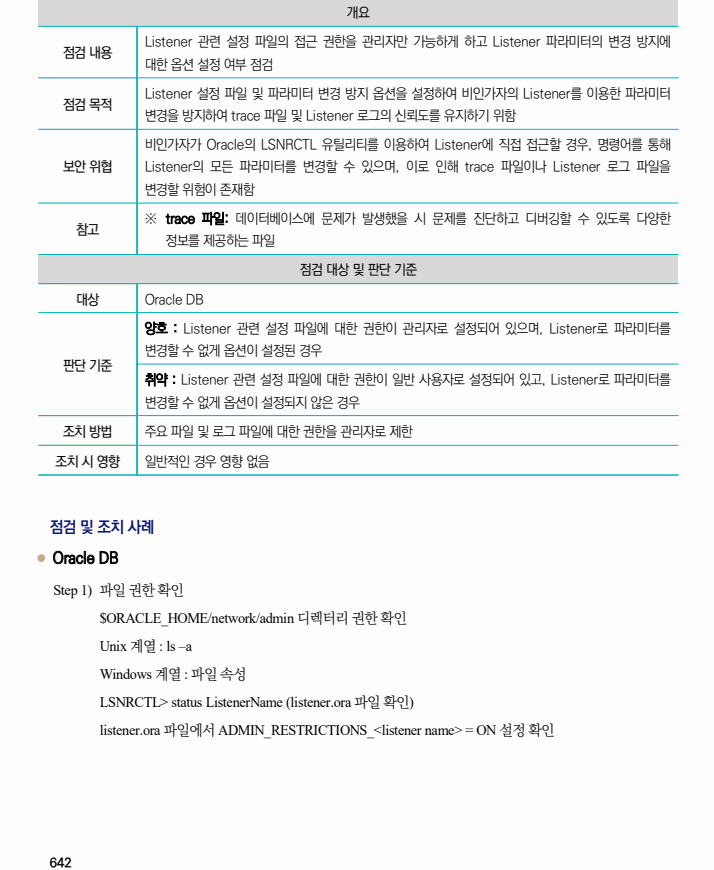
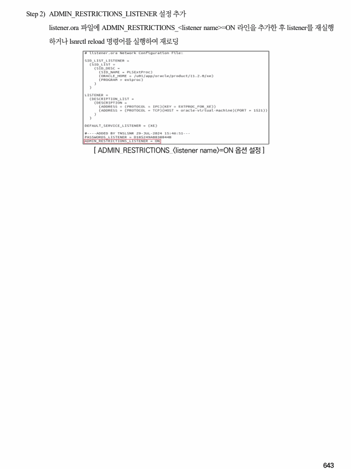

## 원문 전사

### PDF 페이지 642

~~~text transcription
개요
Listener 관련 설정 파일의 접근 권한을 관리자만 가능하게 하고 Listener 파라미터의 변경 방지에
점검 내용
대한 옵션 설정 여부 점검
Listener 설정 파일 및 파라미터 변경 방지 옵션을 설정하여 비인가자의 Listener를 이용한 파라미터
점검 목적
변경을 방지하여 trace 파일 및 Listener 로그의 신뢰도를 유지하기 위함
비인가자가 Oracle의 LSNRCTL 유틸리티를 이용하여 Listener에 직접 접근할 경우, 명령어를 통해
보안 위협 Listener의 모든 파라미터를 변경할 수 있으며, 이로 인해 trace 파일이나 Listener 로그 파일을
변경할 위험이 존재함
※ trace 파일: 데이터베이스에 문제가 발생했을 시 문제를 진단하고 디버깅할 수 있도록 다양한
참고
정보를 제공하는 파일
점검 대상 및 판단 기준
대상 Oracle DB
양호 : Listener 관련 설정 파일에 대한 권한이 관리자로 설정되어 있으며, Listener로 파라미터를
변경할 수 없게 옵션이 설정된 경우
판단 기준
취약 : Listener 관련 설정 파일에 대한 권한이 일반 사용자로 설정되어 있고, Listener로 파라미터를
변경할 수 없게 옵션이 설정되지 않은 경우
조치 방법 주요 파일 및 로그 파일에 대한 권한을 관리자로 제한
조치 시 영향 일반적인 경우 영향 없음
점검 및 조치 사례
l Oracle DB
Step 1) 파일 권한 확인
$ORACLE_HOME/network/admin 디렉터리 권한 확인
Unix 계열 : ls –a
Windows 계열 : 파일 속성
LSNRCTL> status ListenerName (listener.ora 파일 확인)
listener.ora 파일에서 ADMIN_RESTRICTIONS_<listener name> = ON 설정 확인
~~~

### PDF 페이지 643

~~~text transcription
Step 2) ADMIN_RESTRICTIONS_LISTENER 설정 추가
listener.ora 파일에 ADMIN_RESTRICTIONS_<listener name>=ON 라인을 추가한 후 listener를 재실행
하거나 lsnrctl reload 명령어를 실행하여 재로딩
[ ADMIN_RESTRICTIONS_<listener name>=ON 옵션 설정 ]
~~~

