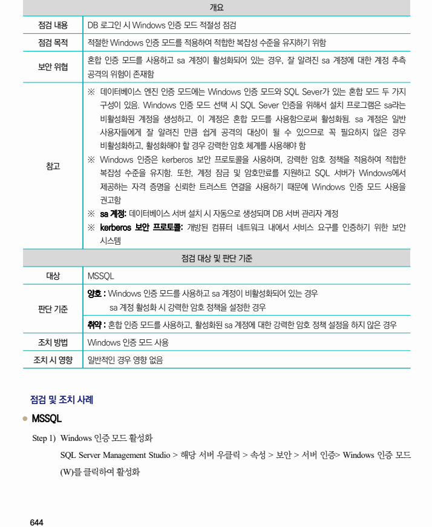
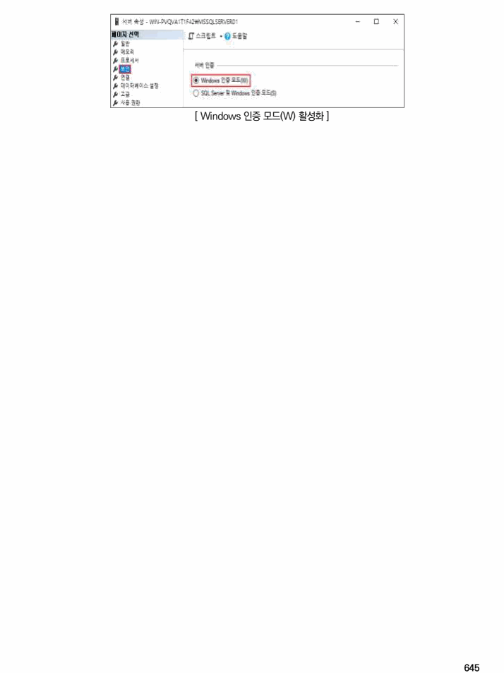

## 원문 전사

### PDF 페이지 644

~~~text transcription
개요
점검 내용 DB 로그인 시 Windows 인증 모드 적절성 점검
점검 목적 적절한 Windows 인증 모드를 적용하여 적합한 복잡성 수준을 유지하기 위함
혼합 인증 모드를 사용하고 sa 계정이 활성화되어 있는 경우, 잘 알려진 sa 계정에 대한 계정 추측
보안 위협
공격의 위험이 존재함
※ 데이터베이스 엔진 인증 모드에는 Windows 인증 모드와 SQL Sever가 있는 혼합 모드 두 가지
구성이 있음. Windows 인증 모드 선택 시 SQL Sever 인증을 위해서 설치 프로그램은 sa라는
비활성화된 계정을 생성하고, 이 계정은 혼합 모드를 사용함으로써 활성화됨. sa 계정은 일반
사용자들에게 잘 알려진 만큼 쉽게 공격의 대상이 될 수 있으므로 꼭 필요하지 않은 경우
비활성화하고, 활성화해야 할 경우 강력한 암호 체계를 사용해야 함
※ Windows 인증은 kerberos 보안 프로토콜을 사용하며, 강력한 암호 정책을 적용하여 적합한
참고
복잡성 수준을 유지함. 또한, 계정 잠금 및 암호만료를 지원하고 SQL 서버가 Windows에서
제공하는 자격 증명을 신뢰한 트러스트 연결을 사용하기 때문에 Windows 인증 모드 사용을
권고함
※ sa 계정: 데이터베이스 서버 설치 시 자동으로 생성되며 DB 서버 관리자 계정
※ kerberos 보안 프로토콜: 개방된 컴퓨터 네트워크 내에서 서비스 요구를 인증하기 위한 보안
시스템
점검 대상 및 판단 기준
대상 MSSQL
양호 : Windows 인증 모드를 사용하고 sa 계정이 비활성화되어 있는 경우
판단 기준 sa 계정 활성화 시 강력한 암호 정책을 설정한 경우
취약 : 혼합 인증 모드를 사용하고, 활성화된 sa 계정에 대한 강력한 암호 정책 설정을 하지 않은 경우
조치 방법 Windows 인증 모드 사용
조치 시 영향 일반적인 경우 영향 없음
점검 및 조치 사례
l MSSQL
Step 1) Windows 인증 모드 활성화
SQL Server Management Studio > 해당 서버 우클릭 > 속성 > 보안 > 서버 인증> Windows 인증 모드
(W)를 클릭하여 활성화
~~~

### PDF 페이지 645

~~~text transcription
[ Windows 인증 모드(W) 활성화 ]
~~~

