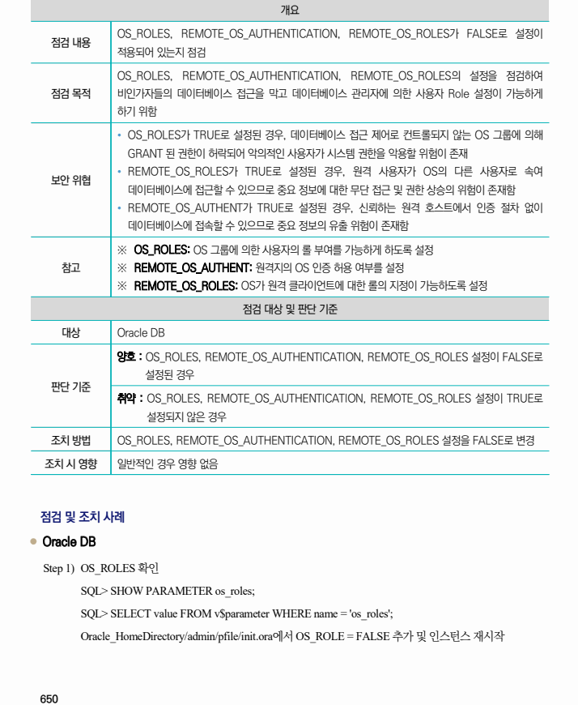
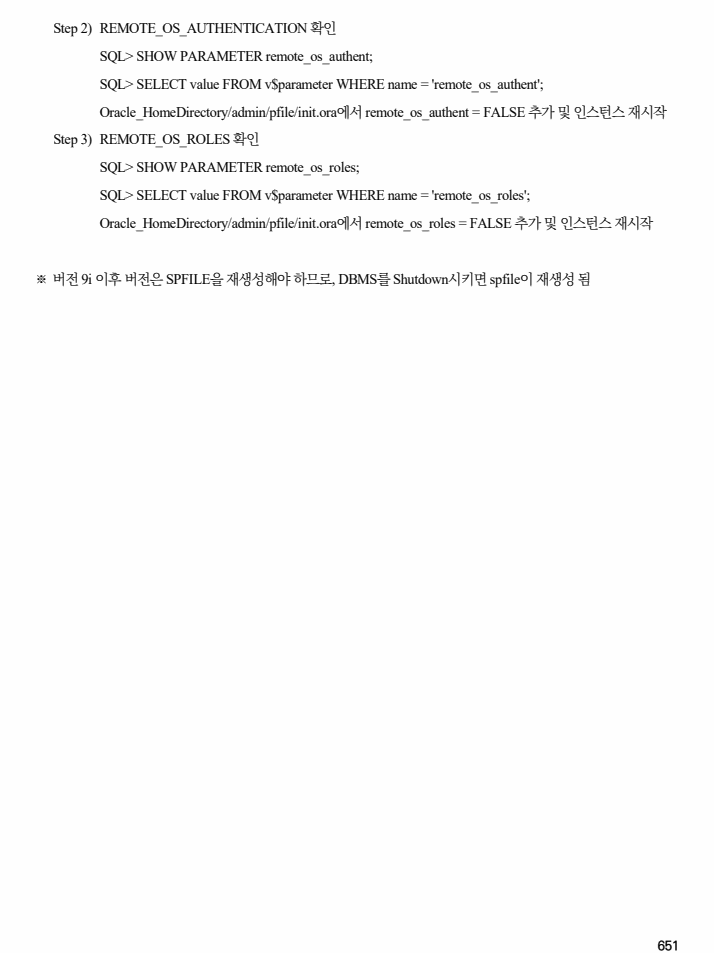

## 원문 전사

### PDF 페이지 650

~~~text transcription
개요
OS_ROLES, REMOTE_OS_AUTHENTICATION, REMOTE_OS_ROLES가 FALSE로 설정이
점검 내용
적용되어 있는지 점검
OS_ROLES, REMOTE_OS_AUTHENTICATION, REMOTE_OS_ROLES의 설정을 점검하여
점검 목적 비인가자들의 데이터베이스 접근을 막고 데이터베이스 관리자에 의한 사용자 Role 설정이 가능하게
하기 위함
Ÿ OS_ROLES가 TRUE로 설정된 경우, 데이터베이스 접근 제어로 컨트롤되지 않는 OS 그룹에 의해
GRANT 된 권한이 허락되어 악의적인 사용자가 시스템 권한을 악용할 위험이 존재
Ÿ REMOTE_OS_ROLES가 TRUE로 설정된 경우, 원격 사용자가 OS의 다른 사용자로 속여
보안 위협
데이터베이스에 접근할 수 있으므로 중요 정보에 대한 무단 접근 및 권한 상승의 위험이 존재함
Ÿ REMOTE_OS_AUTHENT가 TRUE로 설정된 경우, 신뢰하는 원격 호스트에서 인증 절차 없이
데이터베이스에 접속할 수 있으므로 중요 정보의 유출 위험이 존재함
※ OS_ROLES: OS 그룹에 의한 사용자의 롤 부여를 가능하게 하도록 설정
참고 ※ REMOTE_OS_AUTHENT: 원격지의 OS 인증 허용 여부를 설정
※ REMOTE_OS_ROLES: OS가 원격 클라이언트에 대한 롤의 지정이 가능하도록 설정
점검 대상 및 판단 기준
대상 Oracle DB
양호 : OS_ROLES, REMOTE_OS_AUTHENTICATION, REMOTE_OS_ROLES 설정이 FALSE로
설정된 경우
판단 기준
취약 : OS_ROLES, REMOTE_OS_AUTHENTICATION, REMOTE_OS_ROLES 설정이 TRUE로
설정되지 않은 경우
조치 방법 OS_ROLES, REMOTE_OS_AUTHENTICATION, REMOTE_OS_ROLES 설정을 FALSE로 변경
조치 시 영향 일반적인 경우 영향 없음
점검 및 조치 사례
l Oracle DB
Step 1) OS_ROLES 확인
SQL> SHOW PARAMETER os_roles;
SQL> SELECT value FROM v$parameter WHERE name = 'os_roles';
Oracle_HomeDirectory/admin/pfile/init.ora에서 OS_ROLE = FALSE 추가 및 인스턴스 재시작
~~~

### PDF 페이지 651

~~~text transcription
Step 2) REMOTE_OS_AUTHENTICATION 확인
SQL> SHOW PARAMETER remote_os_authent;
SQL> SELECT value FROM v$parameter WHERE name = 'remote_os_authent';
Oracle_HomeDirectory/admin/pfile/init.ora에서 remote_os_authent = FALSE 추가 및 인스턴스 재시작
Step 3) REMOTE_OS_ROLES 확인
SQL> SHOW PARAMETER remote_os_roles;
SQL> SELECT value FROM v$parameter WHERE name = 'remote_os_roles';
Oracle_HomeDirectory/admin/pfile/init.ora에서 remote_os_roles = FALSE 추가 및 인스턴스 재시작
※ 버전 9i 이후 버전은 SPFILE을 재생성해야 하므로, DBMS를 Shutdown시키면 spfile이 재생성 됨
~~~

