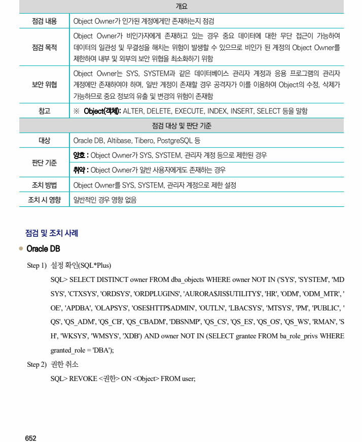
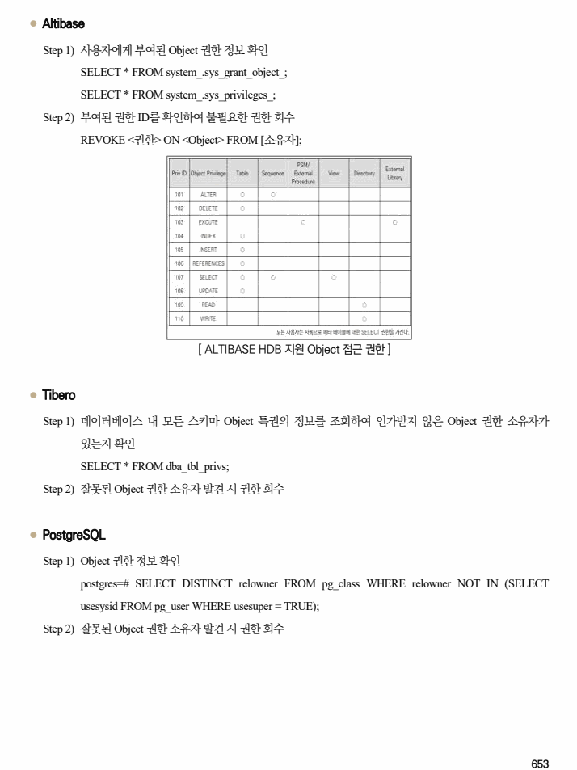

## 원문 전사

### PDF 페이지 652

~~~text transcription
개요
점검 내용 Object Owner가 인가된 계정에게만 존재하는지 점검
Object Owner가 비인가자에게 존재하고 있는 경우 중요 데이터에 대한 무단 접근이 가능하여
점검 목적 데이터의 일관성 및 무결성을 해치는 위험이 발생할 수 있으므로 비인가 된 계정의 Object Owner를
제한하여 내부 및 외부의 보안 위협을 최소화하기 위함
Object Owner는 SYS, SYSTEM과 같은 데이터베이스 관리자 계정과 응용 프로그램의 관리자
보안 위협 계정에만 존재하여야 하며, 일반 계정이 존재할 경우 공격자가 이를 이용하여 Object의 수정, 삭제가
가능하므로 중요 정보의 유출 및 변경의 위험이 존재함
참고 ※ Object(객체): ALTER, DELETE, EXECUTE, INDEX, INSERT, SELECT 등을 말함
점검 대상 및 판단 기준
대상 Oracle DB, Altibase, Tibero, PostgreSQL 등
양호 : Object Owner가 SYS, SYSTEM, 관리자 계정 등으로 제한된 경우
판단 기준
취약 : Object Owner가 일반 사용자에게도 존재하는 경우
조치 방법 Object Owner를 SYS, SYSTEM, 관리자 계정으로 제한 설정
조치 시 영향 일반적인 경우 영향 없음
점검 및 조치 사례
l Oracle DB
Step 1) 설정 확인(SQL*Plus)
SQL> SELECT DISTINCT owner FROM dba_objects WHERE owner NOT IN ('SYS', 'SYSTEM', 'MD
SYS', 'CTXSYS', 'ORDSYS', 'ORDPLUGINS', 'AURORA$JIS$UTILITY$', 'HR', 'ODM', 'ODM_MTR', '
OE', 'APDBA', 'OLAPSYS', 'OSE$HTTP$ADMIN', 'OUTLN', 'LBACSYS', 'MTSYS', 'PM', 'PUBLIC', '
QS', 'QS_ADM', 'QS_CB', 'QS_CBADM', 'DBSNMP', 'QS_CS', 'QS_ES', 'QS_OS', 'QS_WS', 'RMAN', 'S
H', 'WKSYS', 'WMSYS', 'XDB') AND owner NOT IN (SELECT grantee FROM ba_role_privs WHERE
granted_role = 'DBA');
Step 2) 권한 취소
SQL> REVOKE <권한> ON <Object> FROM user;
~~~

### PDF 페이지 653

~~~text transcription
l Altibase
Step 1) 사용자에게 부여된 Object 권한 정보 확인
SELECT * FROM system_.sys_grant_object_;
SELECT * FROM system_.sys_privileges_;
Step 2) 부여된 권한 ID를 확인하여 불필요한 권한 회수
REVOKE <권한> ON <Object> FROM [소유자];
[ ALTIBASE HDB 지원 Object 접근 권한 ]
l Tibero
Step 1) 데이터베이스 내 모든 스키마 Object 특권의 정보를 조회하여 인가받지 않은 Object 권한 소유자가
있는지 확인
SELECT * FROM dba_tbl_privs;
Step 2) 잘못된 Object 권한 소유자 발견 시 권한 회수
l PostgreSQL
Step 1) Object 권한 정보 확인
postgres=# SELECT DISTINCT relowner FROM pg_class WHERE relowner NOT IN (SELECT
usesysid FROM pg_user WHERE usesuper = TRUE);
Step 2) 잘못된 Object 권한 소유자 발견 시 권한 회수
~~~

