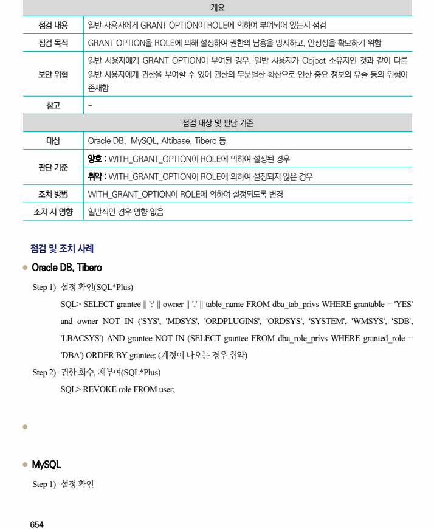
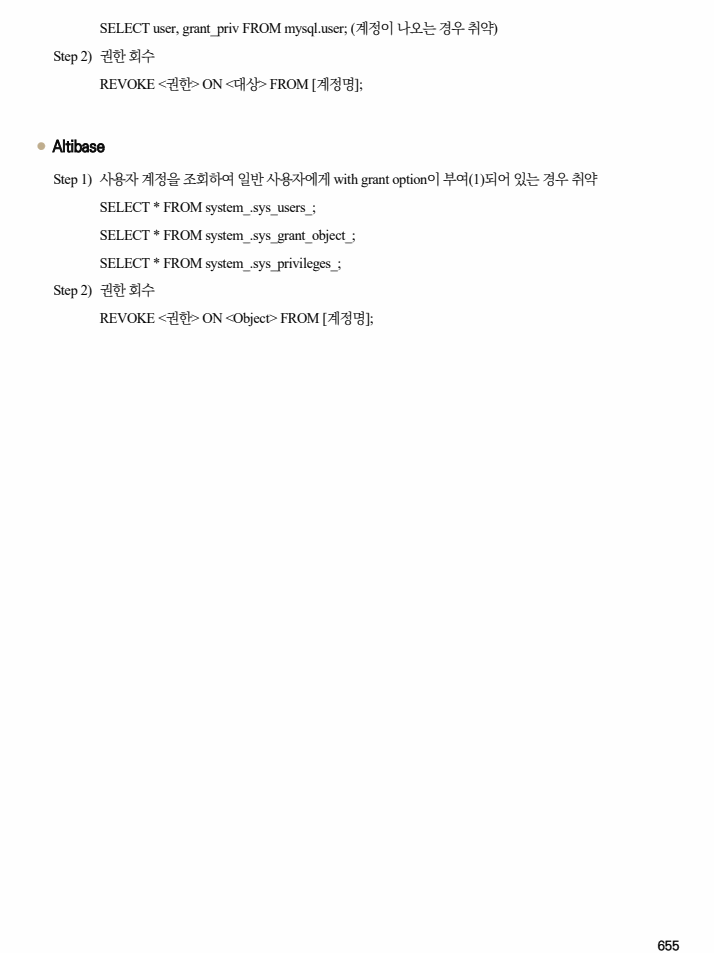

## 원문 전사

### PDF 페이지 654

~~~text transcription
개요
점검 내용 일반 사용자에게 GRANT OPTION이 ROLE에 의하여 부여되어 있는지 점검
점검 목적 GRANT OPTION을 ROLE에 의해 설정하여 권한의 남용을 방지하고, 안정성을 확보하기 위함
일반 사용자에게 GRANT OPTION이 부여된 경우, 일반 사용자가 Object 소유자인 것과 같이 다른
보안 위협 일반 사용자에게 권한을 부여할 수 있어 권한의 무분별한 확산으로 인한 중요 정보의 유출 등의 위험이
존재함
참고 -
점검 대상 및 판단 기준
대상 Oracle DB, MySQL, Altibase, Tibero 등
양호 : WITH_GRANT_OPTION이 ROLE에 의하여 설정된 경우
판단 기준
취약 : WITH_GRANT_OPTION이 ROLE에 의하여 설정되지 않은 경우
조치 방법 WITH_GRANT_OPTION이 ROLE에 의하여 설정되도록 변경
조치 시 영향 일반적인 경우 영향 없음
점검 및 조치 사례
l Oracle DB, Tibero
Step 1) 설정 확인(SQL*Plus)
SQL> SELECT grantee || ':' || owner || '.' || table_name FROM dba_tab_privs WHERE grantable = 'YES'
and owner NOT IN ('SYS', 'MDSYS', 'ORDPLUGINS', 'ORDSYS', 'SYSTEM', 'WMSYS', 'SDB',
'LBACSYS') AND grantee NOT IN (SELECT grantee FROM dba_role_privs WHERE granted_role =
'DBA') ORDER BY grantee; (계정이 나오는 경우 취약)
Step 2) 권한 회수, 재부여(SQL*Plus)
SQL> REVOKE role FROM user;
l
l MySQL
Step 1) 설정 확인
~~~

### PDF 페이지 655

~~~text transcription
SELECT user, grant_priv FROM mysql.user; (계정이 나오는 경우 취약)
Step 2) 권한 회수
REVOKE <권한> ON <대상> FROM [계정명];
l Altibase
Step 1) 사용자 계정을 조회하여 일반 사용자에게 with grant option이 부여(1)되어 있는 경우 취약
SELECT * FROM system_.sys_users_;
SELECT * FROM system_.sys_grant_object_;
SELECT * FROM system_.sys_privileges_;
Step 2) 권한 회수
REVOKE <권한> ON <Object> FROM [계정명];
~~~

