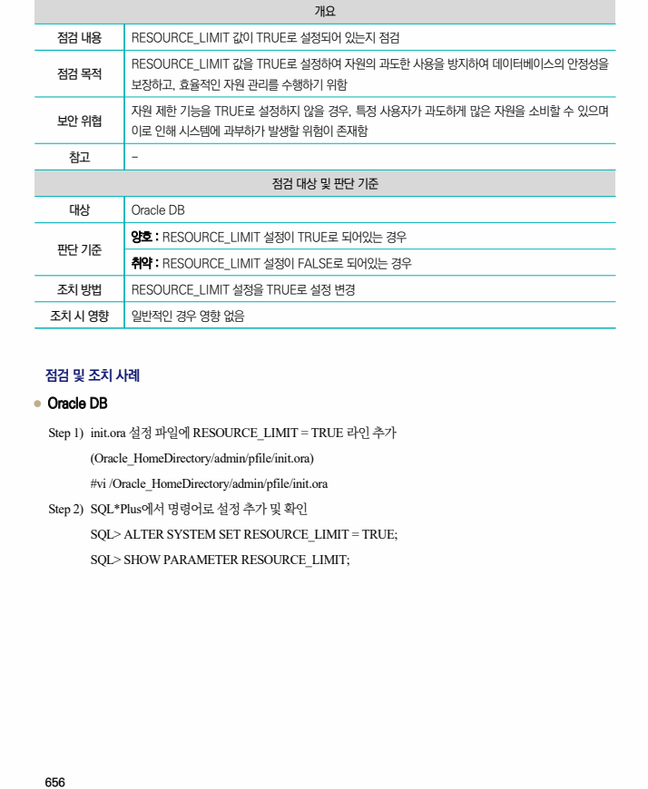

## 원문 전사

### PDF 페이지 656

~~~text transcription
개요
점검 내용 RESOURCE_LIMIT 값이 TRUE로 설정되어 있는지 점검
RESOURCE_LIMIT 값을 TRUE로 설정하여 자원의 과도한 사용을 방지하여 데이터베이스의 안정성을
점검 목적
보장하고, 효율적인 자원 관리를 수행하기 위함
자원 제한 기능을 TRUE로 설정하지 않을 경우, 특정 사용자가 과도하게 많은 자원을 소비할 수 있으며
보안 위협
이로 인해 시스템에 과부하가 발생할 위험이 존재함
참고 -
점검 대상 및 판단 기준
대상 Oracle DB
양호 : RESOURCE_LIMIT 설정이 TRUE로 되어있는 경우
판단 기준
취약 : RESOURCE_LIMIT 설정이 FALSE로 되어있는 경우
조치 방법 RESOURCE_LIMIT 설정을 TRUE로 설정 변경
조치 시 영향 일반적인 경우 영향 없음
점검 및 조치 사례
l Oracle DB
Step 1) init.ora 설정 파일에 RESOURCE_LIMIT = TRUE 라인 추가
(Oracle_HomeDirectory/admin/pfile/init.ora)
#vi /Oracle_HomeDirectory/admin/pfile/init.ora
Step 2) SQL*Plus에서 명령어로 설정 추가 및 확인
SQL> ALTER SYSTEM SET RESOURCE_LIMIT = TRUE;
SQL> SHOW PARAMETER RESOURCE_LIMIT;
~~~

