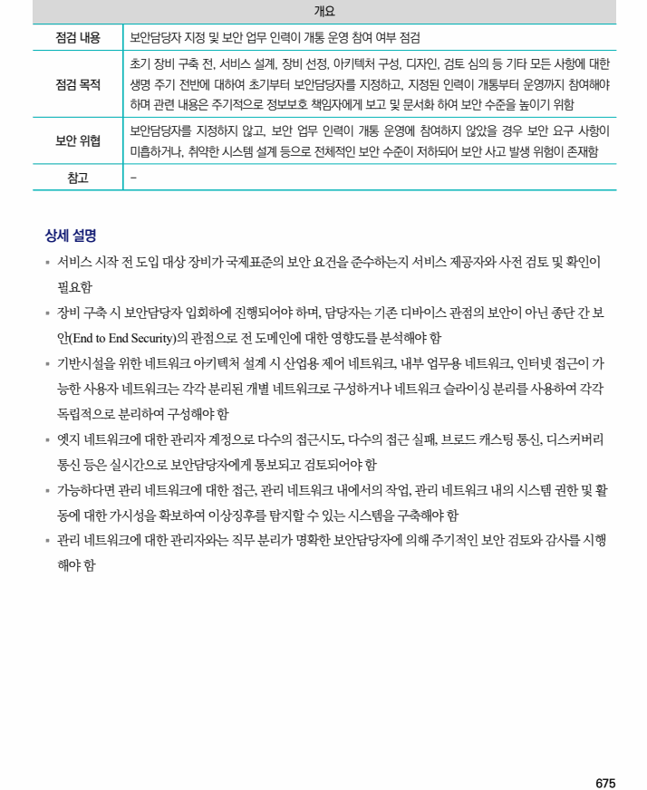

## 원문 전사

### PDF 페이지 675

~~~text transcription
개요
점검 내용 보안담당자 지정 및 보안 업무 인력이 개통 운영 참여 여부 점검
초기 장비 구축 전, 서비스 설계, 장비 선정, 아키텍처 구성, 디자인, 검토 심의 등 기타 모든 사항에 대한
점검 목적 생명 주기 전반에 대하여 초기부터 보안담당자를 지정하고, 지정된 인력이 개통부터 운영까지 참여해야
하며 관련 내용은 주기적으로 정보보호 책임자에게 보고 및 문서화 하여 보안 수준을 높이기 위함
보안담당자를 지정하지 않고, 보안 업무 인력이 개통 운영에 참여하지 않았을 경우 보안 요구 사항이
보안 위협
미흡하거나, 취약한 시스템 설계 등으로 전체적인 보안 수준이 저하되어 보안 사고 발생 위험이 존재함
참고 -
상세 설명
§ 서비스 시작 전 도입 대상 장비가 국제표준의 보안 요건을 준수하는지 서비스 제공자와 사전 검토 및 확인이
필요함
§ 장비 구축 시 보안담당자 입회하에 진행되어야 하며, 담당자는 기존 디바이스 관점의 보안이 아닌 종단 간 보
안(End to End Security)의 관점으로 전 도메인에 대한 영향도를 분석해야 함
§ 기반시설을 위한 네트워크 아키텍처 설계 시 산업용 제어 네트워크, 내부 업무용 네트워크, 인터넷 접근이 가
능한 사용자 네트워크는 각각 분리된 개별 네트워크로 구성하거나 네트워크 슬라이싱 분리를 사용하여 각각
독립적으로 분리하여 구성해야 함
§ 엣지 네트워크에 대한 관리자 계정으로 다수의 접근시도, 다수의 접근 실패, 브로드 캐스팅 통신, 디스커버리
통신 등은 실시간으로 보안담당자에게 통보되고 검토되어야 함
§ 가능하다면 관리 네트워크에 대한 접근, 관리 네트워크 내에서의 작업, 관리 네트워크 내의 시스템 권한 및 활
동에 대한 가시성을 확보하여 이상징후를 탐지할 수 있는 시스템을 구축해야 함
§ 관리 네트워크에 대한 관리자와는 직무 분리가 명확한 보안담당자에 의해 주기적인 보안 검토와 감사를 시행
해야 함
~~~

