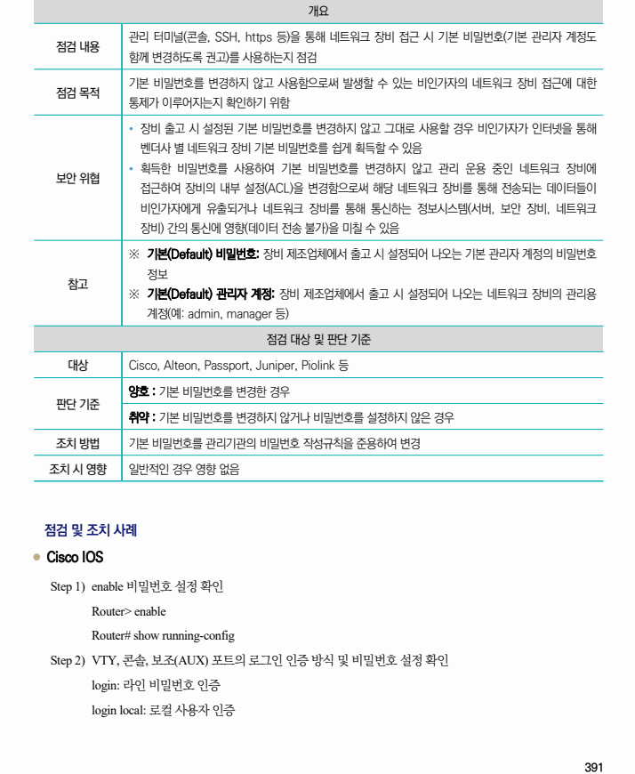
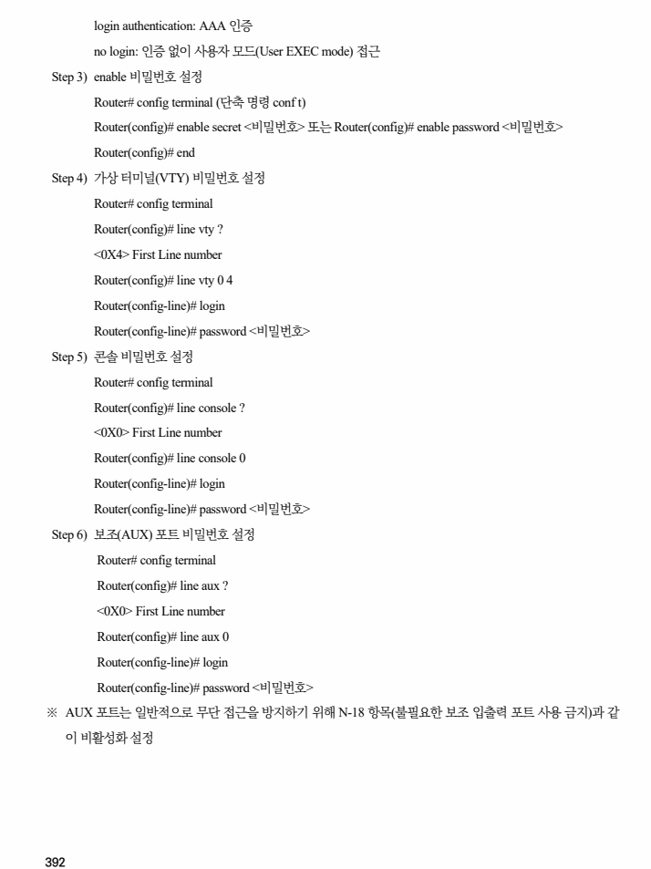
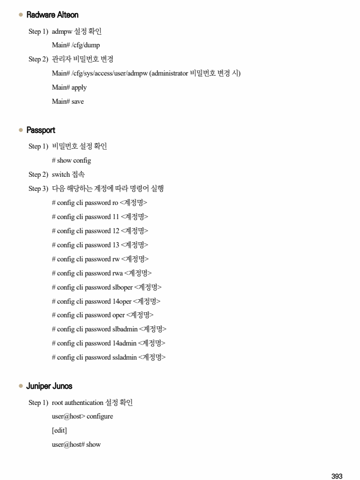
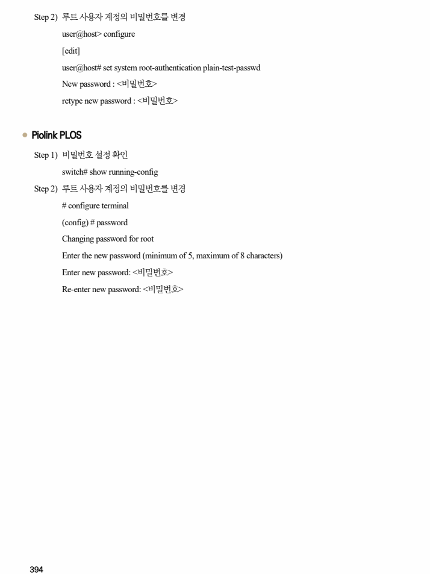

## 원문 전사

### PDF 페이지 391

~~~text transcription
개요
관리 터미널(콘솔, SSH, https 등)을 통해 네트워크 장비 접근 시 기본 비밀번호(기본 관리자 계정도
점검 내용
함께 변경하도록 권고)를 사용하는지 점검
기본 비밀번호를 변경하지 않고 사용함으로써 발생할 수 있는 비인가자의 네트워크 장비 접근에 대한
점검 목적
통제가 이루어지는지 확인하기 위함
Ÿ 장비 출고 시 설정된 기본 비밀번호를 변경하지 않고 그대로 사용할 경우 비인가자가 인터넷을 통해
벤더사 별 네트워크 장비 기본 비밀번호를 쉽게 획득할 수 있음
Ÿ 획득한 비밀번호를 사용하여 기본 비밀번호를 변경하지 않고 관리 운용 중인 네트워크 장비에
보안 위협
접근하여 장비의 내부 설정(ACL)을 변경함으로써 해당 네트워크 장비를 통해 전송되는 데이터들이
비인가자에게 유출되거나 네트워크 장비를 통해 통신하는 정보시스템(서버, 보안 장비, 네트워크
장비) 간의 통신에 영향(데이터 전송 불가)을 미칠 수 있음
※ 기본(Default) 비밀번호: 장비 제조업체에서 출고 시 설정되어 나오는 기본 관리자 계정의 비밀번호
정보
참고
※ 기본(Default) 관리자 계정: 장비 제조업체에서 출고 시 설정되어 나오는 네트워크 장비의 관리용
계정(예: admin, manager 등)
점검 대상 및 판단 기준
대상 Cisco, Alteon, Passport, Juniper, Piolink 등
양호 : 기본 비밀번호를 변경한 경우
판단 기준
취약 : 기본 비밀번호를 변경하지 않거나 비밀번호를 설정하지 않은 경우
조치 방법 기본 비밀번호를 관리기관의 비밀번호 작성규칙을 준용하여 변경
조치 시 영향 일반적인 경우 영향 없음
점검 및 조치 사례
l Cisco IOS
Step 1) enable 비밀번호 설정 확인
Router> enable
Router# show running-config
Step 2) VTY, 콘솔, 보조(AUX) 포트의 로그인 인증 방식 및 비밀번호 설정 확인
login: 라인 비밀번호 인증
login local: 로컬 사용자 인증
~~~

### PDF 페이지 392

~~~text transcription
login authentication: AAA 인증
no login: 인증 없이 사용자 모드(User EXEC mode) 접근
Step 3) enable 비밀번호 설정
Router# config terminal (단축 명령 conf t)
Router(config)# enable secret <비밀번호> 또는 Router(config)# enable password <비밀번호>
Router(config)# end
Step 4) 가상 터미널(VTY) 비밀번호 설정
Router# config terminal
Router(config)# line vty ?
<0X4> First Line number
Router(config)# line vty 0 4
Router(config-line)# login
Router(config-line)# password <비밀번호>
Step 5) 콘솔 비밀번호 설정
Router# config terminal
Router(config)# line console ?
<0X0> First Line number
Router(config)# line console 0
Router(config-line)# login
Router(config-line)# password <비밀번호>
Step 6) 보조(AUX) 포트 비밀번호 설정
Router# config terminal
Router(config)# line aux ?
<0X0> First Line number
Router(config)# line aux 0
Router(config-line)# login
Router(config-line)# password <비밀번호>
※ AUX 포트는 일반적으로 무단 접근을 방지하기 위해 N-18 항목(불필요한 보조 입출력 포트 사용 금지)과 같
이 비활성화 설정
~~~

### PDF 페이지 393

~~~text transcription
l Radware Alteon
Step 1) admpw 설정 확인
Main# /cfg/dump
Step 2) 관리자 비밀번호 변경
Main# /cfg/sys/access/user/admpw (administrator 비밀번호 변경 시)
Main# apply
Main# save
l Passport
Step 1) 비밀번호 설정 확인
# show config
Step 2) switch 접속
Step 3) 다음 해당하는 계정에 따라 명령어 실행
# config cli password ro <계정명>
# config cli password 11 <계정명>
# config cli password 12 <계정명>
# config cli password 13 <계정명>
# config cli password rw <계정명>
# config cli password rwa <계정명>
# config cli password slboper <계정명>
# config cli password 14oper <계정명>
# config cli password oper <계정명>
# config cli password slbadmin <계정명>
# config cli password 14admin <계정명>
# config cli password ssladmin <계정명>
l Juniper Junos
Step 1) root authentication 설정 확인
user@host> configure
[edit]
user@host# show
~~~

### PDF 페이지 394

~~~text transcription
Step 2) 루트 사용자 계정의 비밀번호를 변경
user@host> configure
[edit]
user@host# set system root-authentication plain-test-passwd
New password : <비밀번호>
retype new password : <비밀번호>
l Piolink PLOS
Step 1) 비밀번호 설정 확인
switch# show running-config
Step 2) 루트 사용자 계정의 비밀번호를 변경
# configure terminal
(config) # password
Changing password for root
Enter the new password (minimum of 5, maximum of 8 characters)
Enter new password: <비밀번호>
Re-enter new password: <비밀번호>
~~~

