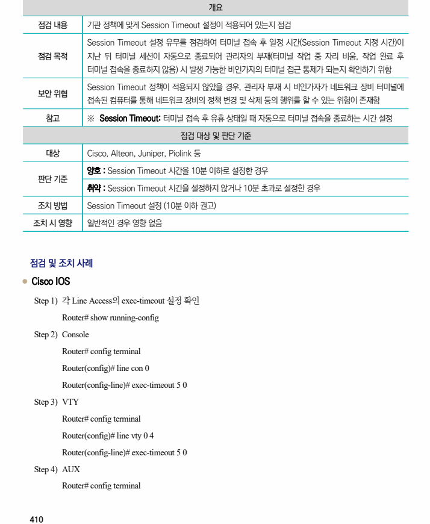
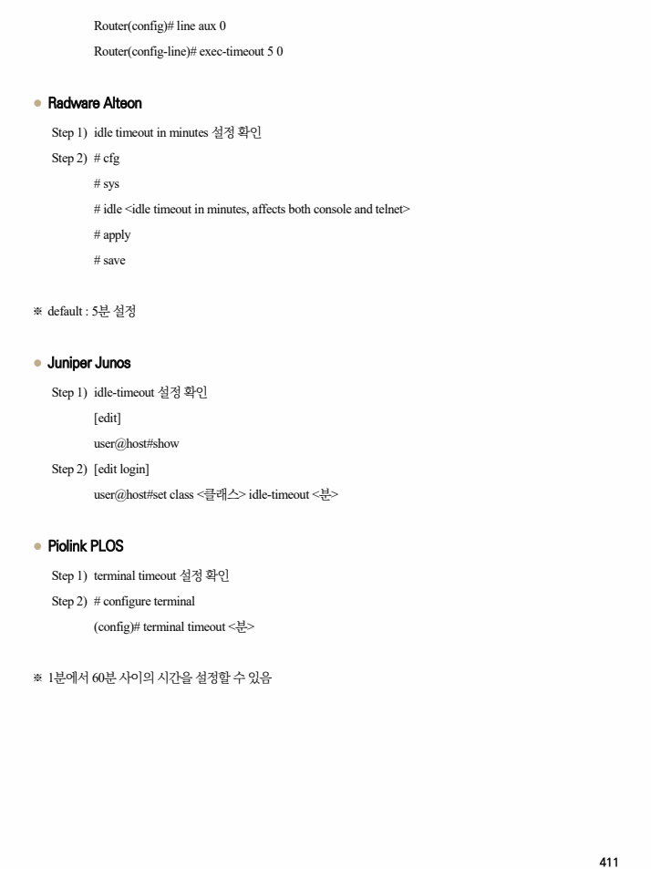

## 원문 전사

### PDF 페이지 410

~~~text transcription
개요
점검 내용 기관 정책에 맞게 Session Timeout 설정이 적용되어 있는지 점검
Session Timeout 설정 유무를 점검하여 터미널 접속 후 일정 시간(Session Timeout 지정 시간)이
점검 목적 지난 뒤 터미널 세션이 자동으로 종료되어 관리자의 부재(터미널 작업 중 자리 비움, 작업 완료 후
터미널 접속을 종료하지 않음) 시 발생 가능한 비인가자의 터미널 접근 통제가 되는지 확인하기 위함
Session Timeout 정책이 적용되지 않았을 경우, 관리자 부재 시 비인가자가 네트워크 장비 터미널에
보안 위협
접속된 컴퓨터를 통해 네트워크 장비의 정책 변경 및 삭제 등의 행위를 할 수 있는 위험이 존재함
참고 ※ Session Timeout: 터미널 접속 후 유휴 상태일 때 자동으로 터미널 접속을 종료하는 시간 설정
점검 대상 및 판단 기준
대상 Cisco, Alteon, Juniper, Piolink 등
양호 : Session Timeout 시간을 10분 이하로 설정한 경우
판단 기준
취약 : Session Timeout 시간을 설정하지 않거나 10분 초과로 설정한 경우
조치 방법 Session Timeout 설정 (10분 이하 권고)
조치 시 영향 일반적인 경우 영향 없음
점검 및 조치 사례
l Cisco IOS
Step 1) 각 Line Access의 exec-timeout 설정 확인
Router# show running-config
Step 2) Console
Router# config terminal
Router(config)# line con 0
Router(config-line)# exec-timeout 5 0
Step 3) VTY
Router# config terminal
Router(config)# line vty 0 4
Router(config-line)# exec-timeout 5 0
Step 4) AUX
Router# config terminal
~~~

### PDF 페이지 411

~~~text transcription
Router(config)# line aux 0
Router(config-line)# exec-timeout 5 0
l Radware Alteon
Step 1) idle timeout in minutes 설정 확인
Step 2) # cfg
# sys
# idle <idle timeout in minutes, affects both console and telnet>
# apply
# save
※ default : 5분 설정
l Juniper Junos
Step 1) idle-timeout 설정 확인
[edit]
user@host#show
Step 2) [edit login]
user@host#set class <클래스> idle-timeout <분>
l Piolink PLOS
Step 1) terminal timeout 설정 확인
Step 2) # configure terminal
(config)# terminal timeout <분>
※ 1분에서 60분 사이의 시간을 설정할 수 있음
~~~

