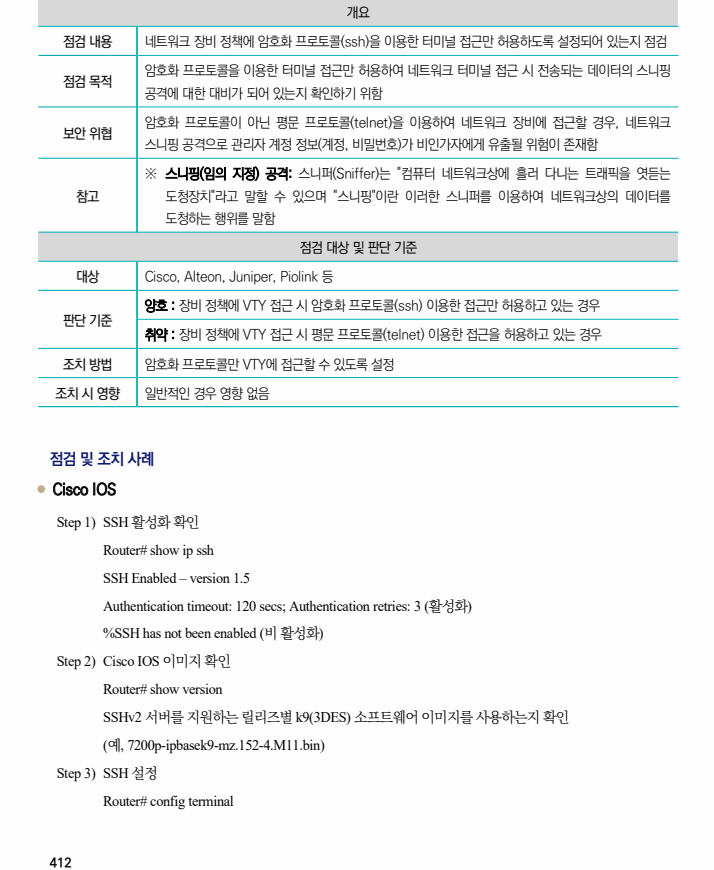
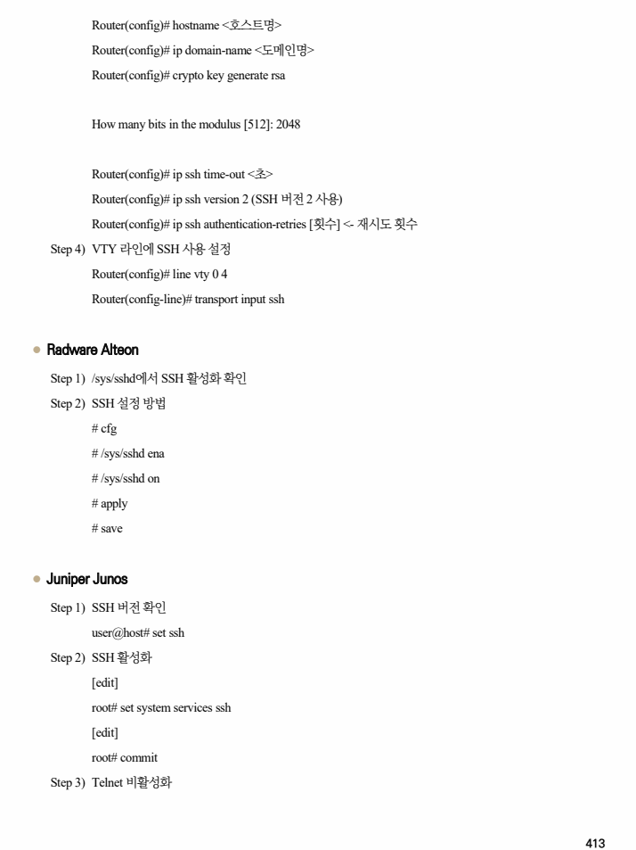
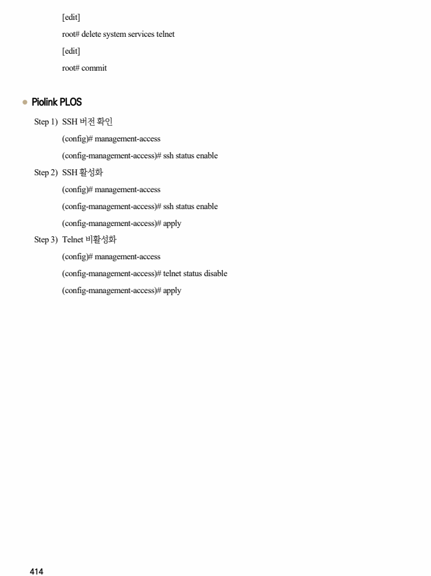

## 원문 전사

### PDF 페이지 412

~~~text transcription
개요
점검 내용 네트워크 장비 정책에 암호화 프로토콜(ssh)을 이용한 터미널 접근만 허용하도록 설정되어 있는지 점검
암호화 프로토콜을 이용한 터미널 접근만 허용하여 네트워크 터미널 접근 시 전송되는 데이터의 스니핑
점검 목적
공격에 대한 대비가 되어 있는지 확인하기 위함
암호화 프로토콜이 아닌 평문 프로토콜(telnet)을 이용하여 네트워크 장비에 접근할 경우, 네트워크
보안 위협
스니핑 공격으로 관리자 계정 정보(계정, 비밀번호)가 비인가자에게 유출될 위험이 존재함
※ 스니핑(임의 지정) 공격: 스니퍼(Sniffer)는 "컴퓨터 네트워크상에 흘러 다니는 트래픽을 엿듣는
참고 도청장치"라고 말할 수 있으며 "스니핑"이란 이러한 스니퍼를 이용하여 네트워크상의 데이터를
도청하는 행위를 말함
점검 대상 및 판단 기준
대상 Cisco, Alteon, Juniper, Piolink 등
양호 : 장비 정책에 VTY 접근 시 암호화 프로토콜(ssh) 이용한 접근만 허용하고 있는 경우
판단 기준
취약 : 장비 정책에 VTY 접근 시 평문 프로토콜(telnet) 이용한 접근을 허용하고 있는 경우
조치 방법 암호화 프로토콜만 VTY에 접근할 수 있도록 설정
조치 시 영향 일반적인 경우 영향 없음
점검 및 조치 사례
l Cisco IOS
Step 1) SSH 활성화 확인
Router# show ip ssh
SSH Enabled – version 1.5
Authentication timeout: 120 secs; Authentication retries: 3 (활성화)
%SSH has not been enabled (비 활성화)
Step 2) Cisco IOS 이미지 확인
Router# show version
SSHv2 서버를 지원하는 릴리즈별 k9(3DES) 소프트웨어 이미지를 사용하는지 확인
(예, 7200p-ipbasek9-mz.152-4.M11.bin)
Step 3) SSH 설정
Router# config terminal
~~~

### PDF 페이지 413

~~~text transcription
Router(config)# hostname <호스트명>
Router(config)# ip domain-name <도메인명>
Router(config)# crypto key generate rsa
How many bits in the modulus [512]: 2048
Router(config)# ip ssh time-out <초>
Router(config)# ip ssh version 2 (SSH 버전 2 사용)
Router(config)# ip ssh authentication-retries [횟수] <- 재시도 횟수
Step 4) VTY 라인에 SSH 사용 설정
Router(config)# line vty 0 4
Router(config-line)# transport input ssh
l Radware Alteon
Step 1) /sys/sshd에서 SSH 활성화 확인
Step 2) SSH 설정 방법
# cfg
# /sys/sshd ena
# /sys/sshd on
# apply
# save
l Juniper Junos
Step 1) SSH 버전 확인
user@host# set ssh
Step 2) SSH 활성화
[edit]
root# set system services ssh
[edit]
root# commit
Step 3) Telnet 비활성화
~~~

### PDF 페이지 414

~~~text transcription
[edit]
root# delete system services telnet
[edit]
root# commit
l Piolink PLOS
Step 1) SSH 버전 확인
(config)# management-access
(config-management-access)# ssh status enable
Step 2) SSH 활성화
(config)# management-access
(config-management-access)# ssh status enable
(config-management-access)# apply
Step 3) Telnet 비활성화
(config)# management-access
(config-management-access)# telnet status disable
(config-management-access)# apply
~~~

