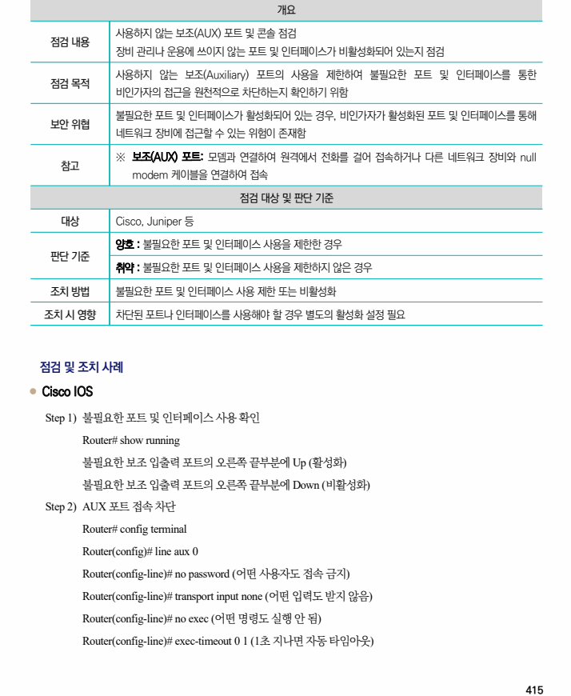
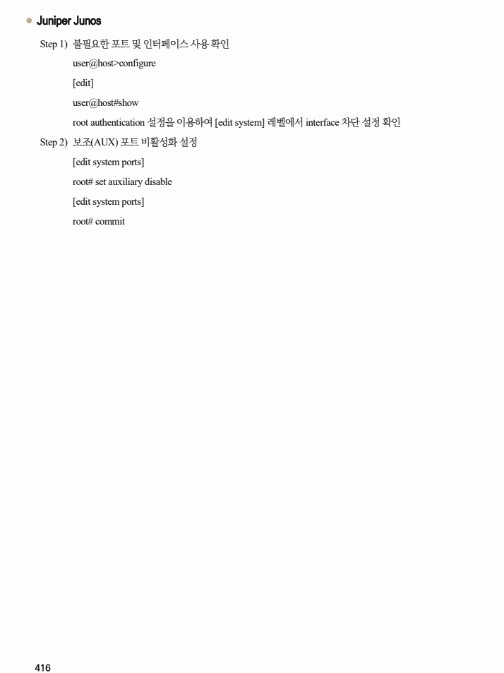

## 원문 전사

### PDF 페이지 415

~~~text transcription
개요
사용하지 않는 보조(AUX) 포트 및 콘솔 점검
점검 내용
장비 관리나 운용에 쓰이지 않는 포트 및 인터페이스가 비활성화되어 있는지 점검
사용하지 않는 보조(Auxiliary) 포트의 사용을 제한하여 불필요한 포트 및 인터페이스를 통한
점검 목적
비인가자의 접근을 원천적으로 차단하는지 확인하기 위함
불필요한 포트 및 인터페이스가 활성화되어 있는 경우, 비인가자가 활성화된 포트 및 인터페이스를 통해
보안 위협
네트워크 장비에 접근할 수 있는 위험이 존재함
※ 보조(AUX) 포트: 모뎀과 연결하여 원격에서 전화를 걸어 접속하거나 다른 네트워크 장비와 null
참고
modem 케이블을 연결하여 접속
점검 대상 및 판단 기준
대상 Cisco, Juniper 등
양호 : 불필요한 포트 및 인터페이스 사용을 제한한 경우
판단 기준
취약 : 불필요한 포트 및 인터페이스 사용을 제한하지 않은 경우
조치 방법 불필요한 포트 및 인터페이스 사용 제한 또는 비활성화
조치 시 영향 차단된 포트나 인터페이스를 사용해야 할 경우 별도의 활성화 설정 필요
점검 및 조치 사례
l Cisco IOS
Step 1) 불필요한 포트 및 인터페이스 사용 확인
Router# show running
불필요한 보조 입출력 포트의 오른쪽 끝부분에 Up (활성화)
불필요한 보조 입출력 포트의 오른쪽 끝부분에 Down (비활성화)
Step 2) AUX 포트 접속 차단
Router# config terminal
Router(config)# line aux 0
Router(config-line)# no password (어떤 사용자도 접속 금지)
Router(config-line)# transport input none (어떤 입력도 받지 않음)
Router(config-line)# no exec (어떤 명령도 실행 안 됨)
Router(config-line)# exec-timeout 0 1 (1초 지나면 자동 타임아웃)
~~~

### PDF 페이지 416

~~~text transcription
l Juniper Junos
Step 1) 불필요한 포트 및 인터페이스 사용 확인
user@host>configure
[edit]
user@host#show
root authentication 설정을 이용하여 [edit system] 레벨에서 interface 차단 설정 확인
Step 2) 보조(AUX) 포트 비활성화 설정
[edit system ports]
root# set auxiliary disable
[edit system ports]
root# commit
~~~

