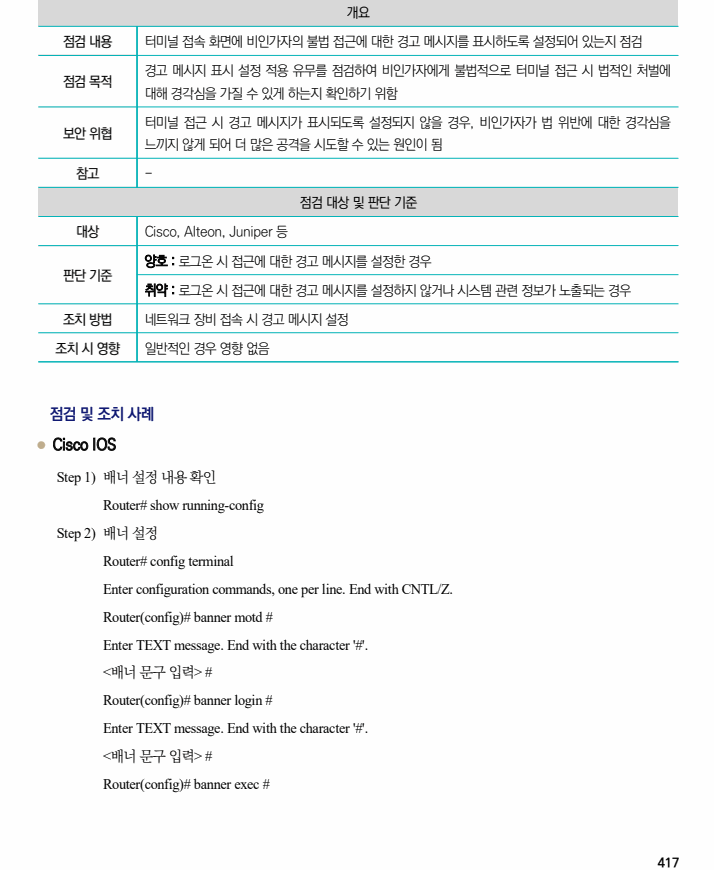
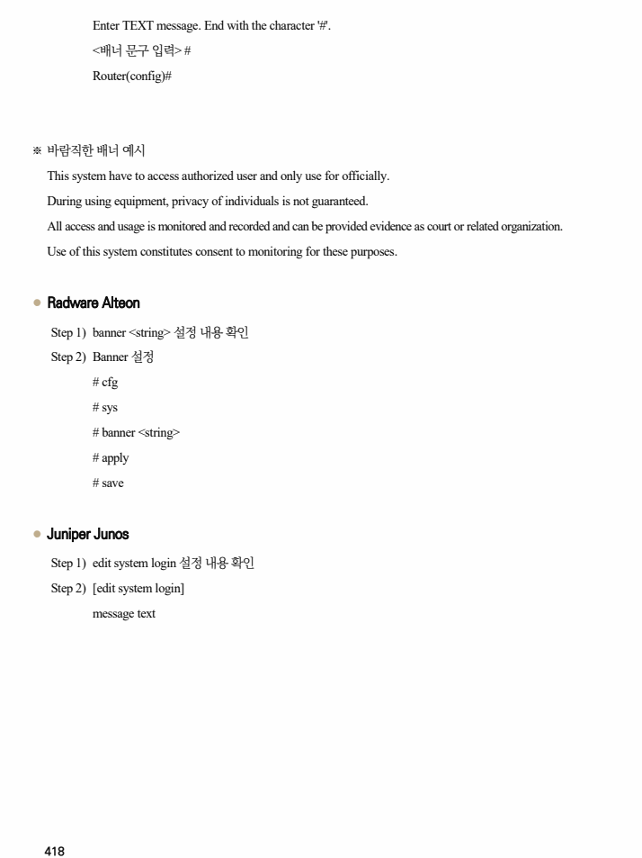

## 원문 전사

### PDF 페이지 417

~~~text transcription
개요
점검 내용 터미널 접속 화면에 비인가자의 불법 접근에 대한 경고 메시지를 표시하도록 설정되어 있는지 점검
경고 메시지 표시 설정 적용 유무를 점검하여 비인가자에게 불법적으로 터미널 접근 시 법적인 처벌에
점검 목적
대해 경각심을 가질 수 있게 하는지 확인하기 위함
터미널 접근 시 경고 메시지가 표시되도록 설정되지 않을 경우, 비인가자가 법 위반에 대한 경각심을
보안 위협
느끼지 않게 되어 더 많은 공격을 시도할 수 있는 원인이 됨
참고 -
점검 대상 및 판단 기준
대상 Cisco, Alteon, Juniper 등
양호 : 로그온 시 접근에 대한 경고 메시지를 설정한 경우
판단 기준
취약 : 로그온 시 접근에 대한 경고 메시지를 설정하지 않거나 시스템 관련 정보가 노출되는 경우
조치 방법 네트워크 장비 접속 시 경고 메시지 설정
조치 시 영향 일반적인 경우 영향 없음
점검 및 조치 사례
l Cisco IOS
Step 1) 배너 설정 내용 확인
Router# show running-config
Step 2) 배너 설정
Router# config terminal
Enter configuration commands, one per line. End with CNTL/Z.
Router(config)# banner motd #
Enter TEXT message. End with the character '#'.
<배너 문구 입력> #
Router(config)# banner login #
Enter TEXT message. End with the character '#'.
<배너 문구 입력> #
Router(config)# banner exec #
~~~

### PDF 페이지 418

~~~text transcription
Enter TEXT message. End with the character '#'.
<배너 문구 입력> #
Router(config)#
※ 바람직한 배너 예시
This system have to access authorized user and only use for officially.
During using equipment, privacy of individuals is not guaranteed.
All access and usage is monitored and recorded and can be provided evidence as court or related organization.
Use of this system constitutes consent to monitoring for these purposes.
l Radware Alteon
Step 1) banner <string> 설정 내용 확인
Step 2) Banner 설정
# cfg
# sys
# banner <string>
# apply
# save
l Juniper Junos
Step 1) edit system login 설정 내용 확인
Step 2) [edit system login]
message text
~~~

