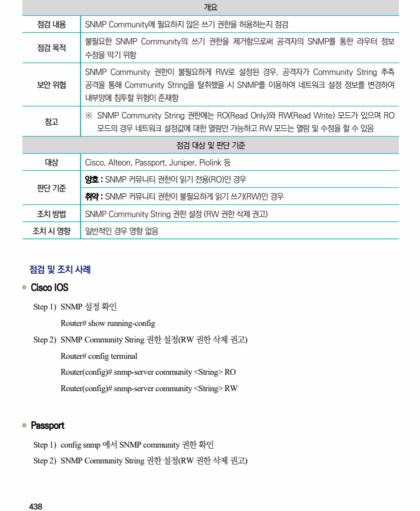
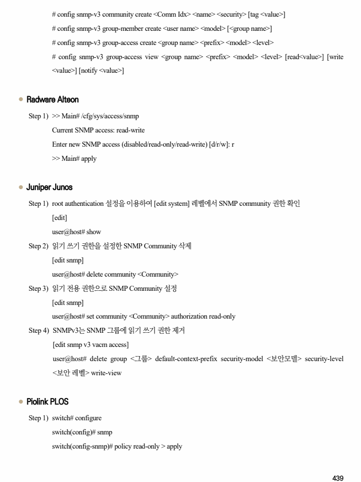

## 원문 전사

### PDF 페이지 438

~~~text transcription
개요
점검 내용 SNMP Community에 필요하지 않은 쓰기 권한을 허용하는지 점검
불필요한 SNMP Community의 쓰기 권한을 제거함으로써 공격자의 SNMP를 통한 라우터 정보
점검 목적
수정을 막기 위함
SNMP Community 권한이 불필요하게 RW로 설정된 경우, 공격자가 Community String 추측
보안 위협 공격을 통해 Community String을 탈취했을 시 SNMP를 이용하여 네트워크 설정 정보를 변경하여
내부망에 침투할 위험이 존재함
※ SNMP Community String 권한에는 RO(Read Only)와 RW(Read Write) 모드가 있으며 RO
참고
모드의 경우 네트워크 설정값에 대한 열람만 가능하고 RW 모드는 열람 및 수정을 할 수 있음
점검 대상 및 판단 기준
대상 Cisco, Alteon, Passport, Juniper, Piolink 등
양호 : SNMP 커뮤니티 권한이 읽기 전용(RO)인 경우
판단 기준
취약 : SNMP 커뮤니티 권한이 불필요하게 읽기 쓰기(RW)인 경우
조치 방법 SNMP Community String 권한 설정 (RW 권한 삭제 권고)
조치 시 영향 일반적인 경우 영향 없음
점검 및 조치 사례
l Cisco IOS
Step 1) SNMP 설정 확인
Router# show running-config
Step 2) SNMP Community String 권한 설정(RW 권한 삭제 권고)
Router# config terminal
Router(config)# snmp-server community <String> RO
Router(config)# snmp-server community <String> RW
l Passport
Step 1) config snmp 에서 SNMP community 권한 확인
Step 2) SNMP Community String 권한 설정(RW 권한 삭제 권고)
~~~

### PDF 페이지 439

~~~text transcription
# config snmp-v3 community create <Comm Idx> <name> <security> [tag <value>]
# config snmp-v3 group-member create <user name> <model> [<group name>]
# config snmp-v3 group-access create <group name> <prefix> <model> <level>
# config snmp-v3 group-access view <group name> <prefix> <model> <level> [read<value>] [write
<value>] [notify <value>]
l Radware Alteon
Step 1) >> Main# /cfg/sys/access/snmp
Current SNMP access: read-write
Enter new SNMP access (disabled/read-only/read-write) [d/r/w]: r
>> Main# apply
l Juniper Junos
Step 1) root authentication 설정을 이용하여 [edit system] 레벨에서 SNMP community 권한 확인
[edit]
user@host# show
Step 2) 읽기 쓰기 권한을 설정한 SNMP Community 삭제
[edit snmp]
user@host# delete community <Community>
Step 3) 읽기 전용 권한으로 SNMP Community 설정
[edit snmp]
user@host# set community <Community> authorization read-only
Step 4) SNMPv3는 SNMP 그룹에 읽기 쓰기 권한 제거
[edit snmp v3 vacm access]
user@host# delete group <그룹> default-context-prefix security-model <보안모델> security-level
<보안 레벨> write-view
l Piolink PLOS
Step 1) switch# configure
switch(config)# snmp
switch(config-snmp)# policy read-only > apply
~~~

