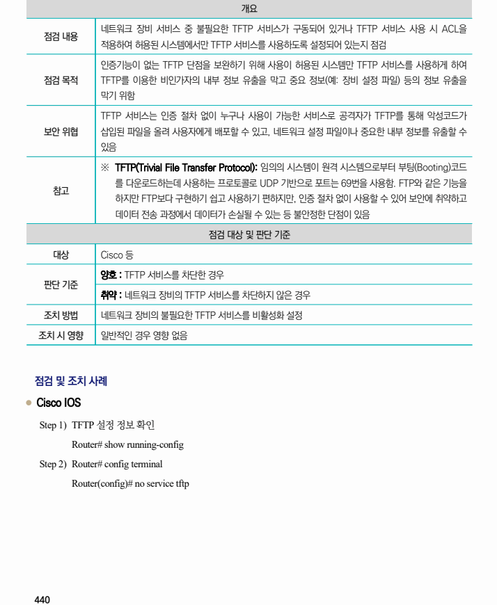

## 원문 전사

### PDF 페이지 440

~~~text transcription
개요
네트워크 장비 서비스 중 불필요한 TFTP 서비스가 구동되어 있거나 TFTP 서비스 사용 시 ACL을
점검 내용
적용하여 허용된 시스템에서만 TFTP 서비스를 사용하도록 설정되어 있는지 점검
인증기능이 없는 TFTP 단점을 보완하기 위해 사용이 허용된 시스템만 TFTP 서비스를 사용하게 하여
점검 목적 TFTP를 이용한 비인가자의 내부 정보 유출을 막고 중요 정보(예: 장비 설정 파일) 등의 정보 유출을
막기 위함
TFTP 서비스는 인증 절차 없이 누구나 사용이 가능한 서비스로 공격자가 TFTP를 통해 악성코드가
보안 위협 삽입된 파일을 올려 사용자에게 배포할 수 있고, 네트워크 설정 파일이나 중요한 내부 정보를 유출할 수
있음
※ TFTP(Trivial File Transfer Protocol): 임의의 시스템이 원격 시스템으로부터 부팅(Booting)코드
를 다운로드하는데 사용하는 프로토콜로 UDP 기반으로 포트는 69번을 사용함. FTP와 같은 기능을
참고
하지만 FTP보다 구현하기 쉽고 사용하기 편하지만, 인증 절차 없이 사용할 수 있어 보안에 취약하고
데이터 전송 과정에서 데이터가 손실될 수 있는 등 불안정한 단점이 있음
점검 대상 및 판단 기준
대상 Cisco 등
양호 : TFTP 서비스를 차단한 경우
판단 기준
취약 : 네트워크 장비의 TFTP 서비스를 차단하지 않은 경우
조치 방법 네트워크 장비의 불필요한 TFTP 서비스를 비활성화 설정
조치 시 영향 일반적인 경우 영향 없음
점검 및 조치 사례
l Cisco IOS
Step 1) TFTP 설정 정보 확인
Router# show running-config
Step 2) Router# config terminal
Router(config)# no service tftp
~~~

