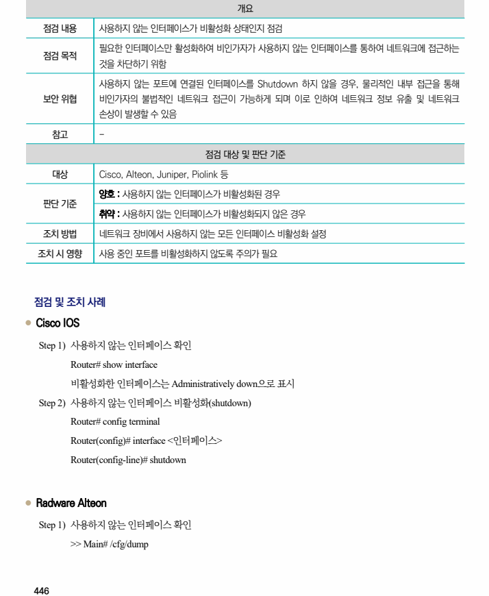
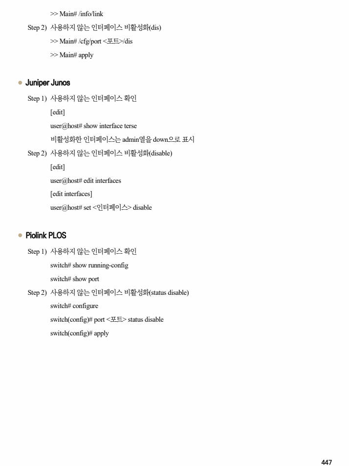

## 원문 전사

### PDF 페이지 446

~~~text transcription
개요
점검 내용 사용하지 않는 인터페이스가 비활성화 상태인지 점검
필요한 인터페이스만 활성화하여 비인가자가 사용하지 않는 인터페이스를 통하여 네트워크에 접근하는
점검 목적
것을 차단하기 위함
사용하지 않는 포트에 연결된 인터페이스를 Shutdown 하지 않을 경우, 물리적인 내부 접근을 통해
보안 위협 비인가자의 불법적인 네트워크 접근이 가능하게 되며 이로 인하여 네트워크 정보 유출 및 네트워크
손상이 발생할 수 있음
참고 -
점검 대상 및 판단 기준
대상 Cisco, Alteon, Juniper, Piolink 등
양호 : 사용하지 않는 인터페이스가 비활성화된 경우
판단 기준
취약 : 사용하지 않는 인터페이스가 비활성화되지 않은 경우
조치 방법 네트워크 장비에서 사용하지 않는 모든 인터페이스 비활성화 설정
조치 시 영향 사용 중인 포트를 비활성화하지 않도록 주의가 필요
점검 및 조치 사례
l Cisco IOS
Step 1) 사용하지 않는 인터페이스 확인
Router# show interface
비활성화한 인터페이스는 Administratively down으로 표시
Step 2) 사용하지 않는 인터페이스 비활성화(shutdown)
Router# config terminal
Router(config)# interface <인터페이스>
Router(config-line)# shutdown
l Radware Alteon
Step 1) 사용하지 않는 인터페이스 확인
>> Main# /cfg/dump
~~~

### PDF 페이지 447

~~~text transcription
>> Main# /info/link
Step 2) 사용하지 않는 인터페이스 비활성화(dis)
>> Main# /cfg/port <포트>/dis
>> Main# apply
l Juniper Junos
Step 1) 사용하지 않는 인터페이스 확인
[edit]
user@host# show interface terse
비활성화한 인터페이스는 admin열을 down으로 표시
Step 2) 사용하지 않는 인터페이스 비활성화(disable)
[edit]
user@host# edit interfaces
[edit interfaces]
user@host# set <인터페이스> disable
l Piolink PLOS
Step 1) 사용하지 않는 인터페이스 확인
switch# show running-config
switch# show port
Step 2) 사용하지 않는 인터페이스 비활성화(status disable)
switch# configure
switch(config)# port <포트> status disable
switch(config)# apply
~~~

