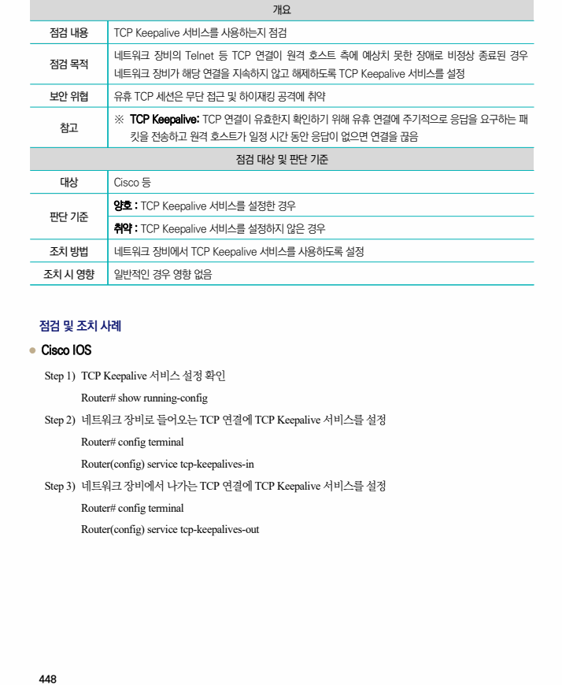

## 원문 전사

### PDF 페이지 448

~~~text transcription
개요
점검 내용 TCP Keepalive 서비스를 사용하는지 점검
네트워크 장비의 Telnet 등 TCP 연결이 원격 호스트 측에 예상치 못한 장애로 비정상 종료된 경우
점검 목적
네트워크 장비가 해당 연결을 지속하지 않고 해제하도록 TCP Keepalive 서비스를 설정
보안 위협 유휴 TCP 세션은 무단 접근 및 하이재킹 공격에 취약
※ TCP Keepalive: TCP 연결이 유효한지 확인하기 위해 유휴 연결에 주기적으로 응답을 요구하는 패
참고
킷을 전송하고 원격 호스트가 일정 시간 동안 응답이 없으면 연결을 끊음
점검 대상 및 판단 기준
대상 Cisco 등
양호 : TCP Keepalive 서비스를 설정한 경우
판단 기준
취약 : TCP Keepalive 서비스를 설정하지 않은 경우
조치 방법 네트워크 장비에서 TCP Keepalive 서비스를 사용하도록 설정
조치 시 영향 일반적인 경우 영향 없음
점검 및 조치 사례
l Cisco IOS
Step 1) TCP Keepalive 서비스 설정 확인
Router# show running-config
Step 2) 네트워크 장비로 들어오는 TCP 연결에 TCP Keepalive 서비스를 설정
Router# config terminal
Router(config) service tcp-keepalives-in
Step 3) 네트워크 장비에서 나가는 TCP 연결에 TCP Keepalive 서비스를 설정
Router# config terminal
Router(config) service tcp-keepalives-out
~~~

