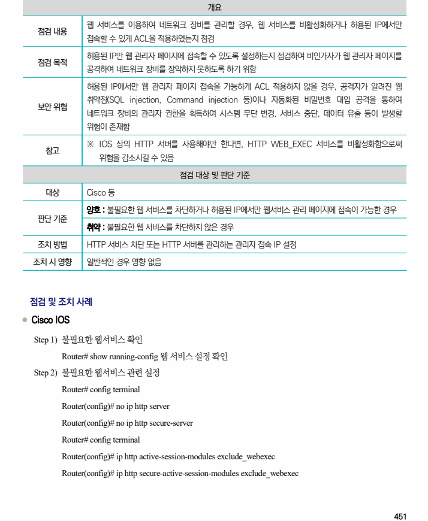
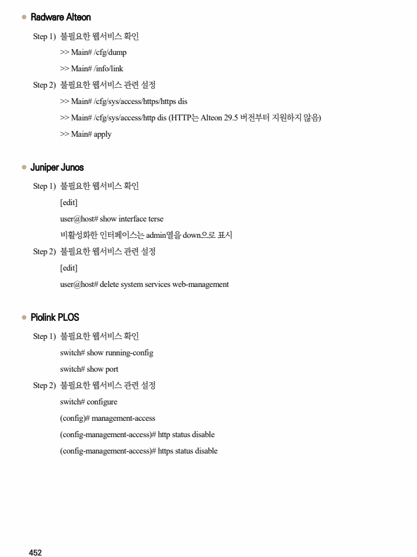

## 원문 전사

### PDF 페이지 451

~~~text transcription
개요
웹 서비스를 이용하여 네트워크 장비를 관리할 경우, 웹 서비스를 비활성화하거나 허용된 IP에서만
점검 내용
접속할 수 있게 ACL을 적용하였는지 점검
허용된 IP만 웹 관리자 페이지에 접속할 수 있도록 설정하는지 점검하여 비인가자가 웹 관리자 페이지를
점검 목적
공격하여 네트워크 장비를 장악하지 못하도록 하기 위함
허용된 IP에서만 웹 관리자 페이지 접속을 가능하게 ACL 적용하지 않을 경우, 공격자가 알려진 웹
취약점(SQL injection, Command injection 등)이나 자동화된 비밀번호 대입 공격을 통하여
보안 위협
네트워크 장비의 관리자 권한을 획득하여 시스템 무단 변경, 서비스 중단, 데이터 유출 등이 발생할
위험이 존재함
※ IOS 상의 HTTP 서버를 사용해야만 한다면, HTTP WEB_EXEC 서비스를 비활성화함으로써
참고
위험을 감소시킬 수 있음
점검 대상 및 판단 기준
대상 Cisco 등
양호 : 불필요한 웹 서비스를 차단하거나 허용된 IP에서만 웹서비스 관리 페이지에 접속이 가능한 경우
판단 기준
취약 : 불필요한 웹 서비스를 차단하지 않은 경우
조치 방법 HTTP 서비스 차단 또는 HTTP 서버를 관리하는 관리자 접속 IP 설정
조치 시 영향 일반적인 경우 영향 없음
점검 및 조치 사례
l Cisco IOS
Step 1) 불필요한 웹서비스 확인
Router# show running-config 웹 서비스 설정 확인
Step 2) 불필요한 웹서비스 관련 설정
Router# config terminal
Router(config)# no ip http server
Router(config)# no ip http secure-server
Router# config terminal
Router(config)# ip http active-session-modules exclude_webexec
Router(config)# ip http secure-active-session-modules exclude_webexec
~~~

### PDF 페이지 452

~~~text transcription
l Radware Alteon
Step 1) 불필요한 웹서비스 확인
>> Main# /cfg/dump
>> Main# /info/link
Step 2) 불필요한 웹서비스 관련 설정
>> Main# /cfg/sys/access/https/https dis
>> Main# /cfg/sys/access/http dis (HTTP는 Alteon 29.5 버전부터 지원하지 않음)
>> Main# apply
l Juniper Junos
Step 1) 불필요한 웹서비스 확인
[edit]
user@host# show interface terse
비활성화한 인터페이스는 admin열을 down으로 표시
Step 2) 불필요한 웹서비스 관련 설정
[edit]
user@host# delete system services web-management
l Piolink PLOS
Step 1) 불필요한 웹서비스 확인
switch# show running-config
switch# show port
Step 2) 불필요한 웹서비스 관련 설정
switch# configure
(config)# management-access
(config-management-access)# http status disable
(config-management-access)# https status disable
~~~

