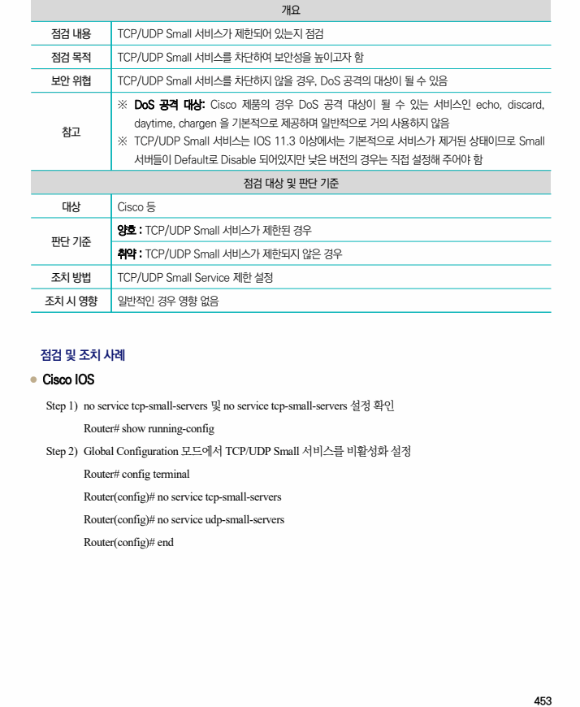

## 원문 전사

### PDF 페이지 453

~~~text transcription
개요
점검 내용 TCP/UDP Small 서비스가 제한되어 있는지 점검
점검 목적 TCP/UDP Small 서비스를 차단하여 보안성을 높이고자 함
보안 위협 TCP/UDP Small 서비스를 차단하지 않을 경우, DoS 공격의 대상이 될 수 있음
※ DoS 공격 대상: Cisco 제품의 경우 DoS 공격 대상이 될 수 있는 서비스인 echo, discard,
daytime, chargen 을 기본적으로 제공하며 일반적으로 거의 사용하지 않음
참고
※ TCP/UDP Small 서비스는 IOS 11.3 이상에서는 기본적으로 서비스가 제거된 상태이므로 Small
서버들이 Default로 Disable 되어있지만 낮은 버전의 경우는 직접 설정해 주어야 함
점검 대상 및 판단 기준
대상 Cisco 등
양호 : TCP/UDP Small 서비스가 제한된 경우
판단 기준
취약 : TCP/UDP Small 서비스가 제한되지 않은 경우
조치 방법 TCP/UDP Small Service 제한 설정
조치 시 영향 일반적인 경우 영향 없음
점검 및 조치 사례
l Cisco IOS
Step 1) no service tcp-small-servers 및 no service tcp-small-servers 설정 확인
Router# show running-config
Step 2) Global Configuration 모드에서 TCP/UDP Small 서비스를 비활성화 설정
Router# config terminal
Router(config)# no service tcp-small-servers
Router(config)# no service udp-small-servers
Router(config)# end
~~~

