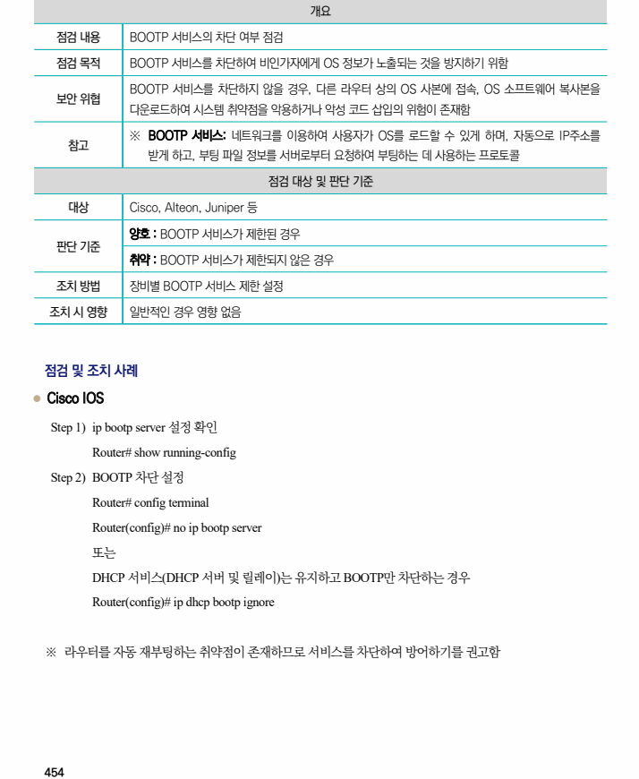
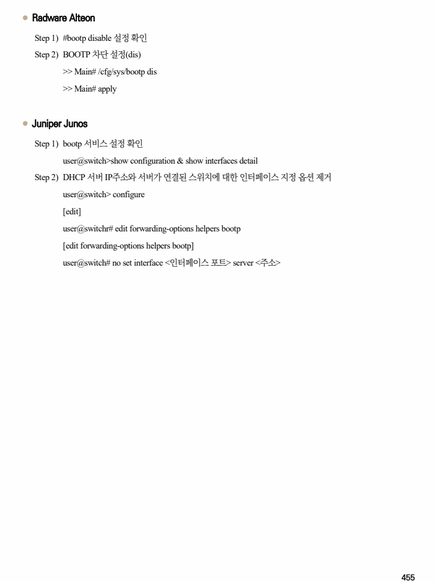

## 원문 전사

### PDF 페이지 454

~~~text transcription
개요
점검 내용 BOOTP 서비스의 차단 여부 점검
점검 목적 BOOTP 서비스를 차단하여 비인가자에게 OS 정보가 노출되는 것을 방지하기 위함
BOOTP 서비스를 차단하지 않을 경우, 다른 라우터 상의 OS 사본에 접속, OS 소프트웨어 복사본을
보안 위협
다운로드하여 시스템 취약점을 악용하거나 악성 코드 삽입의 위험이 존재함
※ BOOTP 서비스: 네트워크를 이용하여 사용자가 OS를 로드할 수 있게 하며, 자동으로 IP주소를
참고
받게 하고, 부팅 파일 정보를 서버로부터 요청하여 부팅하는 데 사용하는 프로토콜
점검 대상 및 판단 기준
대상 Cisco, Alteon, Juniper 등
양호 : BOOTP 서비스가 제한된 경우
판단 기준
취약 : BOOTP 서비스가 제한되지 않은 경우
조치 방법 장비별 BOOTP 서비스 제한 설정
조치 시 영향 일반적인 경우 영향 없음
점검 및 조치 사례
l Cisco IOS
Step 1) ip bootp server 설정 확인
Router# show running-config
Step 2) BOOTP 차단 설정
Router# config terminal
Router(config)# no ip bootp server
또는
DHCP 서비스(DHCP 서버 및 릴레이)는 유지하고 BOOTP만 차단하는 경우
Router(config)# ip dhcp bootp ignore
※ 라우터를 자동 재부팅하는 취약점이 존재하므로 서비스를 차단하여 방어하기를 권고함
~~~

### PDF 페이지 455

~~~text transcription
l Radware Alteon
Step 1) #bootp disable 설정 확인
Step 2) BOOTP 차단 설정(dis)
>> Main# /cfg/sys/bootp dis
>> Main# apply
l Juniper Junos
Step 1) bootp 서비스 설정 확인
user@switch>show configuration & show interfaces detail
Step 2) DHCP 서버 IP주소와 서버가 연결된 스위치에 대한 인터페이스 지정 옵션 제거
user@switch> configure
[edit]
user@switchr# edit forwarding-options helpers bootp
[edit forwarding-options helpers bootp]
user@switch# no set interface <인터페이스 포트> server <주소>
~~~

