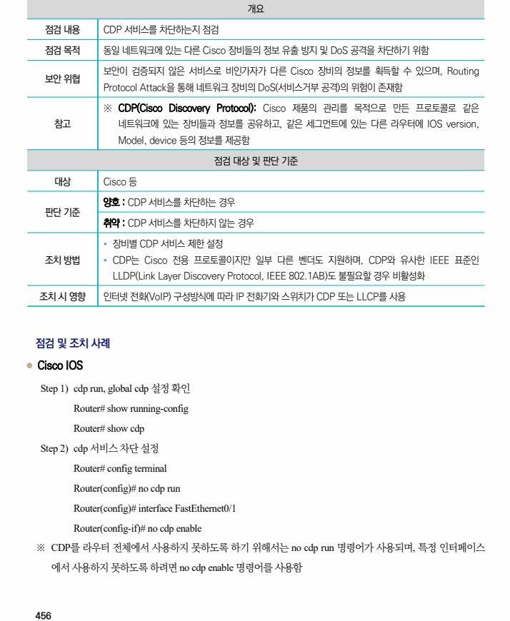

## 원문 전사

### PDF 페이지 456

~~~text transcription
개요
점검 내용 CDP 서비스를 차단하는지 점검
점검 목적 동일 네트워크에 있는 다른 Cisco 장비들의 정보 유출 방지 및 DoS 공격을 차단하기 위함
보안이 검증되지 않은 서비스로 비인가자가 다른 Cisco 장비의 정보를 획득할 수 있으며, Routing
보안 위협
Protocol Attack을 통해 네트워크 장비의 DoS(서비스거부 공격)의 위험이 존재함
※ CDP(Cisco Discovery Protocol): Cisco 제품의 관리를 목적으로 만든 프로토콜로 같은
참고 네트워크에 있는 장비들과 정보를 공유하고, 같은 세그먼트에 있는 다른 라우터에 IOS version,
Model, device 등의 정보를 제공함
점검 대상 및 판단 기준
대상 Cisco 등
양호 : CDP 서비스를 차단하는 경우
판단 기준
취약 : CDP 서비스를 차단하지 않는 경우
Ÿ 장비별 CDP 서비스 제한 설정
조치 방법 Ÿ CDP는 Cisco 전용 프로토콜이지만 일부 다른 벤더도 지원하며, CDP와 유사한 IEEE 표준인
LLDP(Link Layer Discovery Protocol, IEEE 802.1AB)도 불필요할 경우 비활성화
조치 시 영향 인터넷 전화(VoIP) 구성방식에 따라 IP 전화기와 스위치가 CDP 또는 LLCP를 사용
점검 및 조치 사례
l Cisco IOS
Step 1) cdp run, global cdp 설정 확인
Router# show running-config
Router# show cdp
Step 2) cdp 서비스 차단 설정
Router# config terminal
Router(config)# no cdp run
Router(config)# interface FastEthernet0/1
Router(config-if)# no cdp enable
※ CDP를 라우터 전체에서 사용하지 못하도록 하기 위해서는 no cdp run 명령어가 사용되며, 특정 인터페이스
에서 사용하지 못하도록 하려면 no cdp enable 명령어를 사용함
~~~

