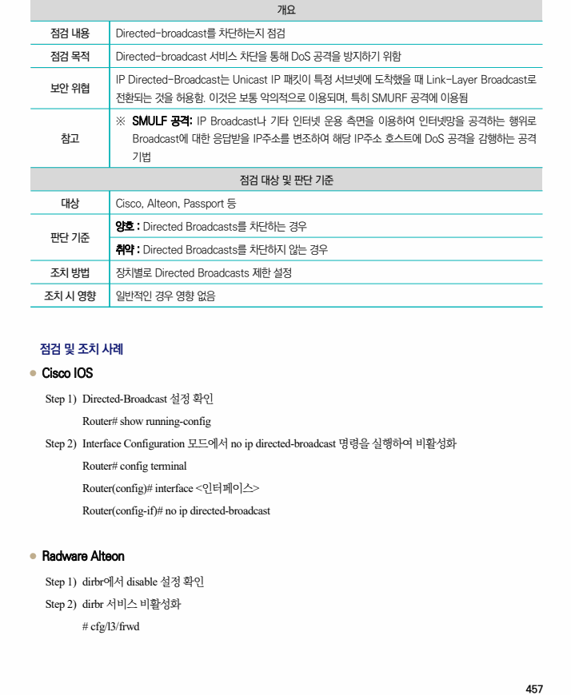
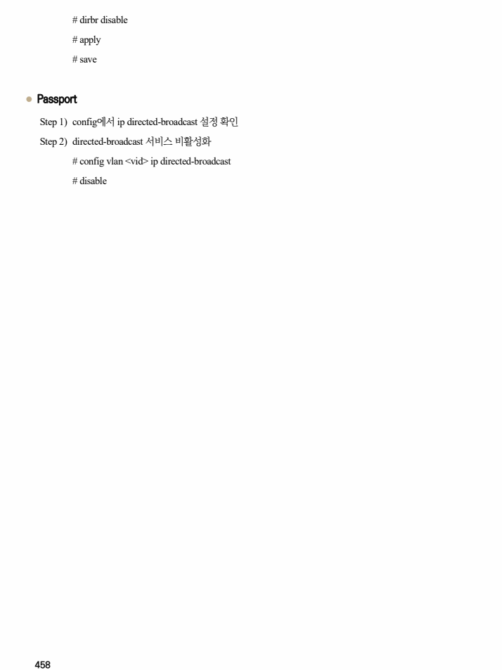

## 원문 전사

### PDF 페이지 457

~~~text transcription
개요
점검 내용 Directed-broadcast를 차단하는지 점검
점검 목적 Directed-broadcast 서비스 차단을 통해 DoS 공격을 방지하기 위함
IP Directed-Broadcast는 Unicast IP 패킷이 특정 서브넷에 도착했을 때 Link-Layer Broadcast로
보안 위협
전환되는 것을 허용함. 이것은 보통 악의적으로 이용되며, 특히 SMURF 공격에 이용됨
※ SMULF 공격: IP Broadcast나 기타 인터넷 운용 측면을 이용하여 인터넷망을 공격하는 행위로
참고 Broadcast에 대한 응답받을 IP주소를 변조하여 해당 IP주소 호스트에 DoS 공격을 감행하는 공격
기법
점검 대상 및 판단 기준
대상 Cisco, Alteon, Passport 등
양호 : Directed Broadcasts를 차단하는 경우
판단 기준
취약 : Directed Broadcasts를 차단하지 않는 경우
조치 방법 장치별로 Directed Broadcasts 제한 설정
조치 시 영향 일반적인 경우 영향 없음
점검 및 조치 사례
l Cisco IOS
Step 1) Directed-Broadcast 설정 확인
Router# show running-config
Step 2) Interface Configuration 모드에서 no ip directed-broadcast 명령을 실행하여 비활성화
Router# config terminal
Router(config)# interface <인터페이스>
Router(config-if)# no ip directed-broadcast
l Radware Alteon
Step 1) dirbr에서 disable 설정 확인
Step 2) dirbr 서비스 비활성화
# cfg/l3/frwd
~~~

### PDF 페이지 458

~~~text transcription
# dirbr disable
# apply
# save
l Passport
Step 1) config에서 ip directed-broadcast 설정 확인
Step 2) directed-broadcast 서비스 비활성화
# config vlan <vid> ip directed-broadcast
# disable
~~~

