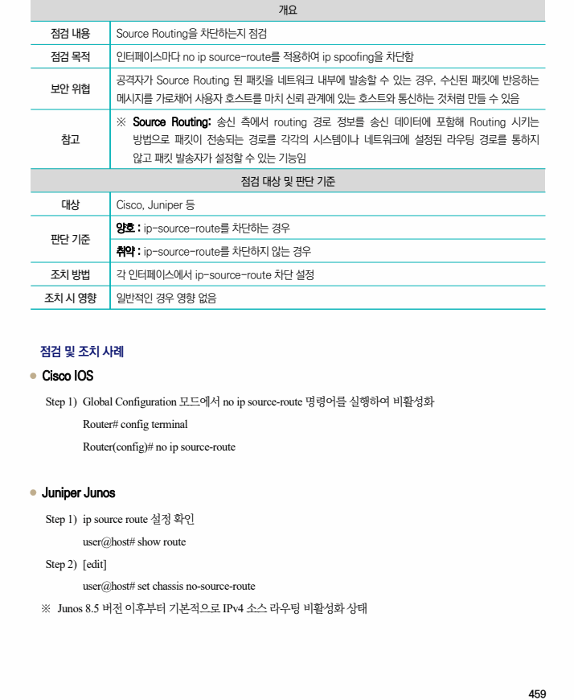

## 원문 전사

### PDF 페이지 459

~~~text transcription
개요
점검 내용 Source Routing을 차단하는지 점검
점검 목적 인터페이스마다 no ip source-route를 적용하여 ip spoofing을 차단함
공격자가 Source Routing 된 패킷을 네트워크 내부에 발송할 수 있는 경우, 수신된 패킷에 반응하는
보안 위협
메시지를 가로채어 사용자 호스트를 마치 신뢰 관계에 있는 호스트와 통신하는 것처럼 만들 수 있음
※ Source Routing: 송신 측에서 routing 경로 정보를 송신 데이터에 포함해 Routing 시키는
참고 방법으로 패킷이 전송되는 경로를 각각의 시스템이나 네트워크에 설정된 라우팅 경로를 통하지
않고 패킷 발송자가 설정할 수 있는 기능임
점검 대상 및 판단 기준
대상 Cisco, Juniper 등
양호 : ip-source-route를 차단하는 경우
판단 기준
취약 : ip-source-route를 차단하지 않는 경우
조치 방법 각 인터페이스에서 ip-source-route 차단 설정
조치 시 영향 일반적인 경우 영향 없음
점검 및 조치 사례
l Cisco IOS
Step 1) Global Configuration 모드에서 no ip source-route 명령어를 실행하여 비활성화
Router# config terminal
Router(config)# no ip source-route
l Juniper Junos
Step 1) ip source route 설정 확인
user@host# show route
Step 2) [edit]
user@host# set chassis no-source-route
※ Junos 8.5 버전 이후부터 기본적으로 IPv4 소스 라우팅 비활성화 상태
~~~

