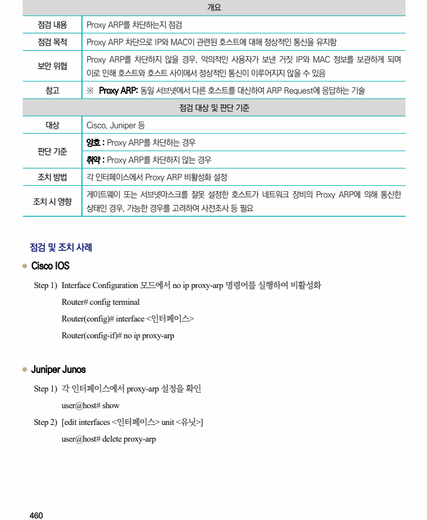

## 원문 전사

### PDF 페이지 460

~~~text transcription
개요
점검 내용 Proxy ARP를 차단하는지 점검
점검 목적 Proxy ARP 차단으로 IP와 MAC이 관련된 호스트에 대해 정상적인 통신을 유지함
Proxy ARP를 차단하지 않을 경우, 악의적인 사용자가 보낸 거짓 IP와 MAC 정보를 보관하게 되며
보안 위협
이로 인해 호스트와 호스트 사이에서 정상적인 통신이 이루어지지 않을 수 있음
참고 ※ Proxy ARP: 동일 서브넷에서 다른 호스트를 대신하여 ARP Request에 응답하는 기술
점검 대상 및 판단 기준
대상 Cisco, Juniper 등
양호 : Proxy ARP를 차단하는 경우
판단 기준
취약 : Proxy ARP를 차단하지 않는 경우
조치 방법 각 인터페이스에서 Proxy ARP 비활성화 설정
게이트웨이 또는 서브넷마스크를 잘못 설정한 호스트가 네트워크 장비의 Proxy ARP에 의해 통신한
조치 시 영향
상태인 경우, 가능한 경우를 고려하여 사전조사 등 필요
점검 및 조치 사례
l Cisco IOS
Step 1) Interface Configuration 모드에서 no ip proxy-arp 명령어를 실행하여 비활성화
Router# config terminal
Router(config)# interface <인터페이스>
Router(config-if)# no ip proxy-arp
l Juniper Junos
Step 1) 각 인터페이스에서 proxy-arp 설정을 확인
user@host# show
Step 2) [edit interfaces <인터페이스> unit <유닛>]
user@host# delete proxy-arp
~~~

