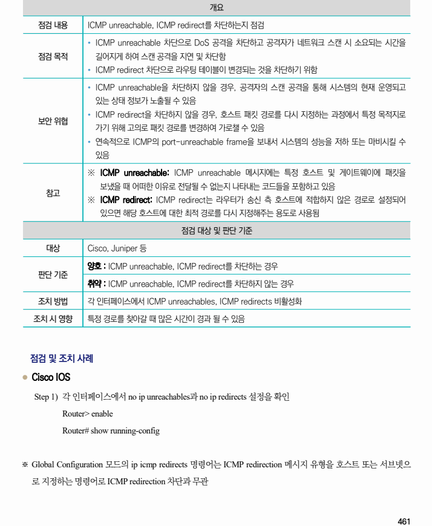
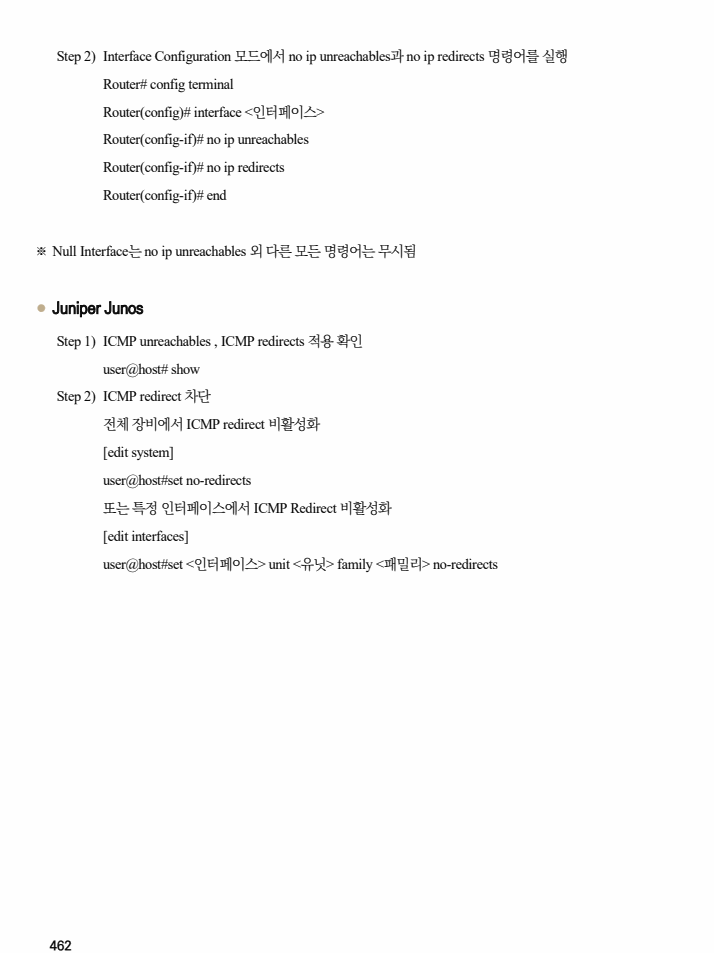

## 원문 전사

### PDF 페이지 461

~~~text transcription
개요
점검 내용 ICMP unreachable, ICMP redirect를 차단하는지 점검
Ÿ ICMP unreachable 차단으로 DoS 공격을 차단하고 공격자가 네트워크 스캔 시 소요되는 시간을
점검 목적 길어지게 하여 스캔 공격을 지연 및 차단함
Ÿ ICMP redirect 차단으로 라우팅 테이블이 변경되는 것을 차단하기 위함
Ÿ ICMP unreachable을 차단하지 않을 경우, 공격자의 스캔 공격을 통해 시스템의 현재 운영되고
있는 상태 정보가 노출될 수 있음
Ÿ ICMP redirect을 차단하지 않을 경우, 호스트 패킷 경로를 다시 지정하는 과정에서 특정 목적지로
보안 위협
가기 위해 고의로 패킷 경로를 변경하여 가로챌 수 있음
Ÿ 연속적으로 ICMP의 port-unreachable frame을 보내서 시스템의 성능을 저하 또는 마비시킬 수
있음
※ ICMP unreachable: ICMP unreachable 메시지에는 특정 호스트 및 게이트웨이에 패킷을
보냈을 때 어떠한 이유로 전달될 수 없는지 나타내는 코드들을 포함하고 있음
참고
※ ICMP redirect: ICMP redirect는 라우터가 송신 측 호스트에 적합하지 않은 경로로 설정되어
있으면 해당 호스트에 대한 최적 경로를 다시 지정해주는 용도로 사용됨
점검 대상 및 판단 기준
대상 Cisco, Juniper 등
양호 : ICMP unreachable, ICMP redirect를 차단하는 경우
판단 기준
취약 : ICMP unreachable, ICMP redirect를 차단하지 않는 경우
조치 방법 각 인터페이스에서 ICMP unreachables, ICMP redirects 비활성화
조치 시 영향 특정 경로를 찾아갈 때 많은 시간이 경과 될 수 있음
점검 및 조치 사례
l Cisco IOS
Step 1) 각 인터페이스에서 no ip unreachables과 no ip redirects 설정을 확인
Router> enable
Router# show running-config
※ Global Configuration 모드의 ip icmp redirects 명령어는 ICMP redirection 메시지 유형을 호스트 또는 서브넷으
로 지정하는 명령어로 ICMP redirection 차단과 무관
~~~

### PDF 페이지 462

~~~text transcription
Step 2) Interface Configuration 모드에서 no ip unreachables과 no ip redirects 명령어를 실행
Router# config terminal
Router(config)# interface <인터페이스>
Router(config-if)# no ip unreachables
Router(config-if)# no ip redirects
Router(config-if)# end
※ Null Interface는 no ip unreachables 외 다른 모든 명령어는 무시됨
l Juniper Junos
Step 1) ICMP unreachables , ICMP redirects 적용 확인
user@host# show
Step 2) ICMP redirect 차단
전체 장비에서 ICMP redirect 비활성화
[edit system]
user@host#set no-redirects
또는 특정 인터페이스에서 ICMP Redirect 비활성화
[edit interfaces]
user@host#set <인터페이스> unit <유닛> family <패밀리> no-redirects
~~~

